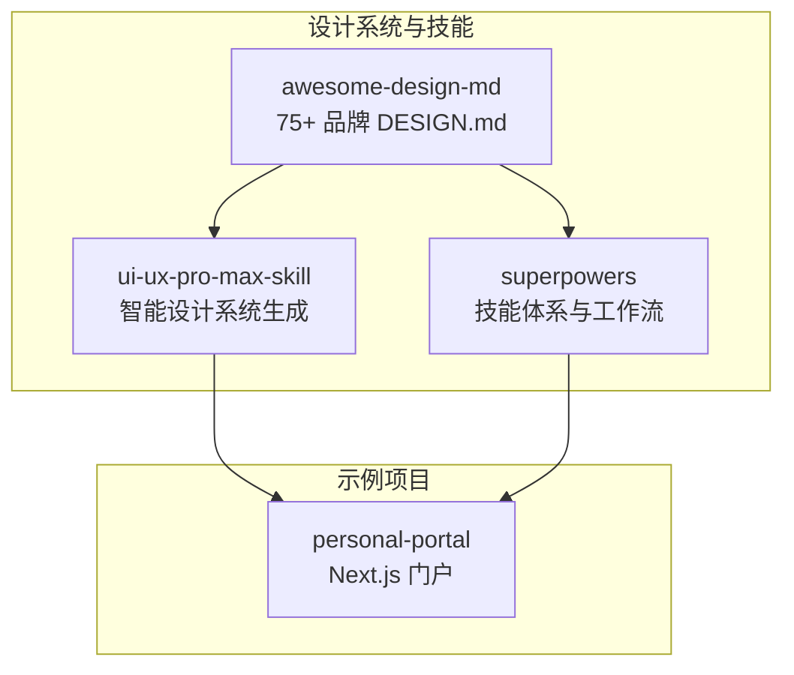
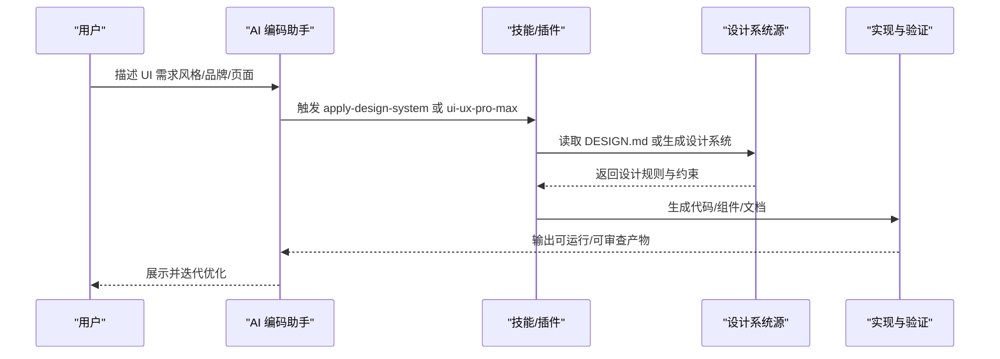
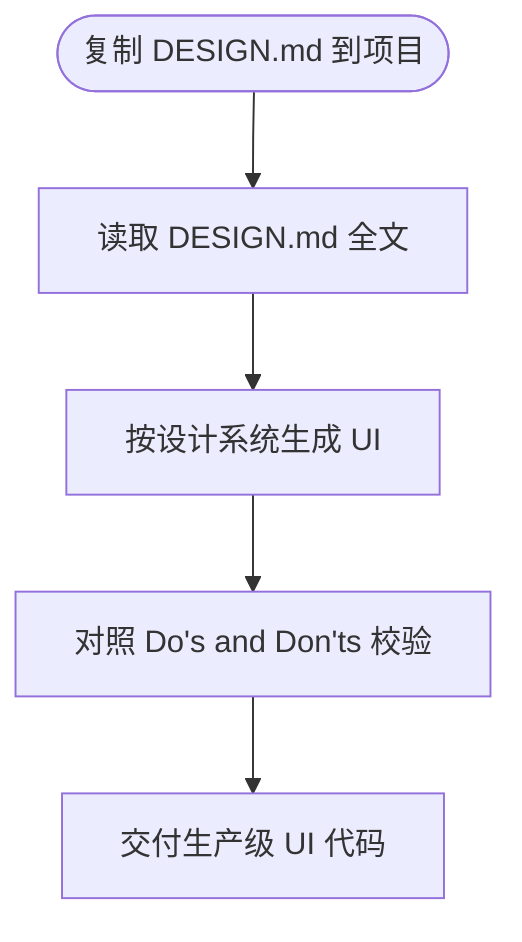
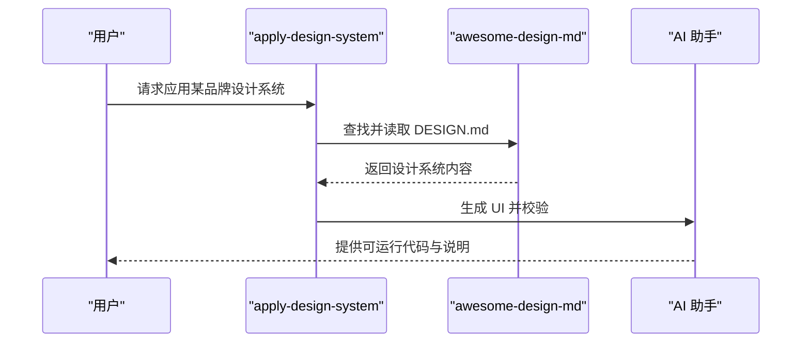
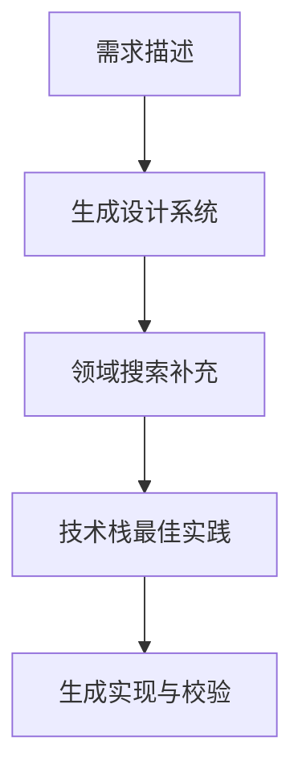
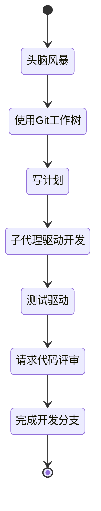
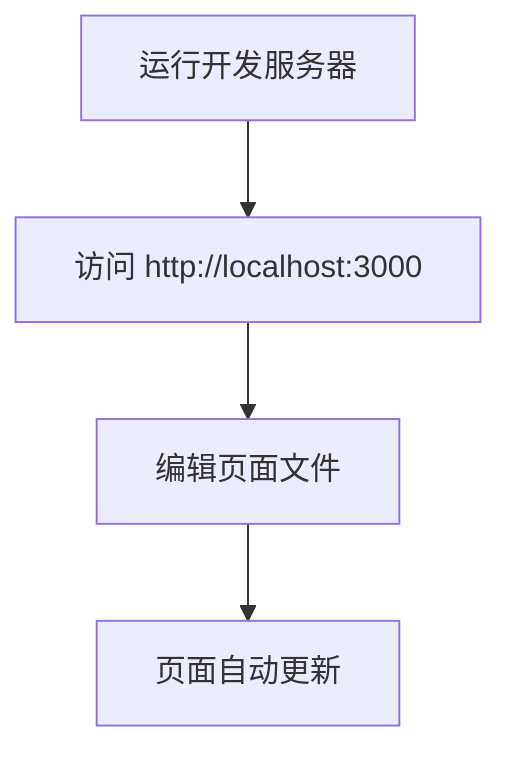
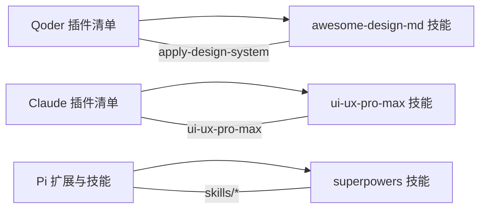

# 快速开始

<cite>
**本文引用的文件**
- [awesome-design-md/README.md](file://awesome-design-md/README.md)
- [awesome-design-md/CONTRIBUTING.md](file://awesome-design-md/CONTRIBUTING.md)
- [awesome-design-md/skills/apply-design-system/SKILL.md](file://awesome-design-md/skills/apply-design-system/SKILL.md)
- [awesome-design-md/design-md/airbnb/DESIGN.md](file://awesome-design-md/design-md/airbnb/DESIGN.md)
- [awesome-design-md/.qoder-plugin/plugin.json](file://awesome-design-md/.qoder-plugin/plugin.json)
- [superpowers/README.md](file://superpowers/README.md)
- [superpowers/package.json](file://superpowers/package.json)
- [ui-ux-pro-max-skill/README.md](file://ui-ux-pro-max-skill/README.md)
- [ui-ux-pro-max-skill/skills/ui-ux-pro-max/SKILL.md](file://ui-ux-pro-max-skill/skills/ui-ux-pro-max/SKILL.md)
- [ui-ux-pro-max-skill/.claude-plugin/plugin.json](file://ui-ux-pro-max-skill/.claude-plugin/plugin.json)
- [personal-portal/README.md](file://personal-portal/README.md)
- [personal-portal/package.json](file://personal-portal/package.json)
</cite>

## 目录
1. [简介](#简介)
2. [项目结构](#项目结构)
3. [核心组件](#核心组件)
4. [架构总览](#架构总览)
5. [详细组件解析](#详细组件解析)
6. [依赖关系分析](#依赖关系分析)
7. [性能与可用性建议](#性能与可用性建议)
8. [故障排查指南](#故障排查指南)
9. [结论](#结论)
10. [附录：面向不同角色的入门路径](#附录面向不同角色的入门路径)

## 简介
本快速开始指南面向首次接触本仓库的用户，帮助你在最短时间内完成环境准备、安装配置与首个使用示例。你将学会：
- 安装与配置 Node.js、Python 等必要运行时
- 在不同 AI 编码助手（Claude Code、Cursor、Codex 等）中安装与启用相关技能插件
- 使用 DESIGN.md 设计系统生成一致的 UI
- 借助 UI/UX Pro Max 技能进行设计系统生成与实现
- 利用 Superpowers 技能体系规范开发流程
- 运行个人门户（Next.js）项目

## 项目结构
本仓库包含多个子项目，围绕“设计系统”“UI/UX 智能化”“自动化开发流程”三大主题协同工作：
- awesome-design-md：提供 75+ 品牌的 DESIGN.md 设计系统，支持直接在 AI 助手中应用
- ui-ux-pro-max-skill：提供智能设计系统生成与实现指引，覆盖多框架栈
- superpowers：提供可组合的开发技能集合，驱动从设计到实现的自动化流程
- personal-portal：基于 Next.js 的个人门户示例项目，可作为实践载体

图示来源
- [awesome-design-md/README.md:27-250](file://awesome-design-md/README.md#L27-L250)
- [ui-ux-pro-max-skill/README.md:1-649](file://ui-ux-pro-max-skill/README.md#L1-L649)
- [superpowers/README.md:1-286](file://superpowers/README.md#L1-L286)
- [personal-portal/README.md:1-37](file://personal-portal/README.md#L1-L37)

章节来源
- [awesome-design-md/README.md:27-250](file://awesome-design-md/README.md#L27-L250)
- [ui-ux-pro-max-skill/README.md:1-649](file://ui-ux-pro-max-skill/README.md#L1-L649)
- [superpowers/README.md:1-286](file://superpowers/README.md#L1-L286)
- [personal-portal/README.md:1-37](file://personal-portal/README.md#L1-L37)

## 核心组件
- DESIGN.md 设计系统：以纯文本形式描述品牌视觉语言，包含配色、字体、组件样式、布局原则、阴影层级、响应式策略与代理提示词等九个维度，便于 AI 读取与生成一致 UI。
- apply-design-system 技能：在 AI 助手中调用，按品牌名或“list”列出可用设计系统，并读取对应 DESIGN.md 文件，指导生成符合该品牌风格的 UI。
- UI/UX Pro Max 技能：根据产品类型、行业与风格关键词，通过搜索与推理引擎生成完整设计系统（模式、风格、色彩、排版、动效），并提供跨栈实现建议与预交付检查清单。
- Superpowers 技能体系：提供从头脑风暴、计划拆解、子代理并行开发、测试驱动、代码评审到分支收尾的自动化工作流，确保工程过程可追踪、可复用。
- personal-portal：Next.js 示例项目，演示如何在真实工程中集成设计系统与组件。

章节来源
- [awesome-design-md/skills/apply-design-system/SKILL.md:10-139](file://awesome-design-md/skills/apply-design-system/SKILL.md#L10-L139)
- [ui-ux-pro-max-skill/skills/ui-ux-pro-max/SKILL.md:6-680](file://ui-ux-pro-max-skill/skills/ui-ux-pro-max/SKILL.md#L6-L680)
- [superpowers/README.md:200-286](file://superpowers/README.md#L200-L286)
- [personal-portal/README.md:1-37](file://personal-portal/README.md#L1-L37)

## 架构总览
下图展示了从“需求描述”到“生成一致 UI”的端到端流程，以及各子项目的协作关系：

图示来源
- [awesome-design-md/skills/apply-design-system/SKILL.md:68-139](file://awesome-design-md/skills/apply-design-system/SKILL.md#L68-L139)
- [ui-ux-pro-max-skill/skills/ui-ux-pro-max/SKILL.md:353-531](file://ui-ux-pro-max-skill/skills/ui-ux-pro-max/SKILL.md#L353-L531)

章节来源
- [awesome-design-md/skills/apply-design-system/SKILL.md:68-139](file://awesome-design-md/skills/apply-design-system/SKILL.md#L68-L139)
- [ui-ux-pro-max-skill/skills/ui-ux-pro-max/SKILL.md:353-531](file://ui-ux-pro-max-skill/skills/ui-ux-pro-max/SKILL.md#L353-L531)

## 详细组件解析

### 组件一：awesome-design-md（DESIGN.md 设计系统）
- 作用：提供 75+ 品牌的 DESIGN.md 设计系统，覆盖 AI 平台、开发者工具、后端数据库、生产力与 SaaS、设计与创意工具、金融科技与加密、电商与零售、媒体与消费科技、汽车与复古 Web 等分类。
- 使用方式：将目标品牌的 DESIGN.md 复制到项目根目录，再在 AI 助手中告知其“按该 DESIGN.md 生成 UI”，即可获得一致的视觉输出。
- 关键特性：每个 DESIGN.md 包含九个维度（主题氛围、配色角色、排版规则、组件样式、布局原则、深度与高程、守则与反模式、响应行为、代理提示词），并提供可视化预览与暗色模式示例。

图示来源
- [awesome-design-md/README.md:228-250](file://awesome-design-md/README.md#L228-L250)
- [awesome-design-md/skills/apply-design-system/SKILL.md:82-121](file://awesome-design-md/skills/apply-design-system/SKILL.md#L82-L121)

章节来源
- [awesome-design-md/README.md:228-250](file://awesome-design-md/README.md#L228-L250)
- [awesome-design-md/skills/apply-design-system/SKILL.md:82-121](file://awesome-design-md/skills/apply-design-system/SKILL.md#L82-L121)

### 组件二：apply-design-system 技能
- 触发条件：当用户请求“按某品牌风格生成 UI”或询问可用设计系统时触发。
- 工作流程：
  - 步骤 1：识别目标品牌，匹配 design-md 下的文件夹名称
  - 步骤 2：读取 DESIGN.md 的九个维度
  - 步骤 3：严格遵循颜色、排版、组件、布局、阴影与响应式规则生成 UI
  - 步骤 4：依据“守则与反模式”进行校验与修正
- 输出：生产级 UI 代码（React/Vue/HTML+CSS），并附带所用设计令牌摘要与适配说明。

图示来源
- [awesome-design-md/skills/apply-design-system/SKILL.md:68-139](file://awesome-design-md/skills/apply-design-system/SKILL.md#L68-L139)

章节来源
- [awesome-design-md/skills/apply-design-system/SKILL.md:68-139](file://awesome-design-md/skills/apply-design-system/SKILL.md#L68-L139)

### 组件三：UI/UX Pro Max 技能
- 适用场景：新建页面、创建/重构 UI 组件、选择配色/排版/间距/布局、审查 UI 代码、实现导航/动画/响应式、做产品级设计决策、提升界面专业度与可用性。
- 工作流：
  - 步骤 1：提取产品类型、受众、风格关键词、技术栈
  - 步骤 2：生成完整设计系统（模式+风格+色彩+排版+动效+反模式）
  - 步骤 3：按需补充领域搜索（风格、UX、图表、字体等）
  - 步骤 4：获取技术栈最佳实践
- 输出：设计系统与实现建议，支持 Markdown 文档与 ASCII 输出两种格式。

图示来源
- [ui-ux-pro-max-skill/skills/ui-ux-pro-max/SKILL.md:353-531](file://ui-ux-pro-max-skill/skills/ui-ux-pro-max/SKILL.md#L353-L531)

章节来源
- [ui-ux-pro-max-skill/skills/ui-ux-pro-max/SKILL.md:353-531](file://ui-ux-pro-max-skill/skills/ui-ux-pro-max/SKILL.md#L353-L531)

### 组件四：Superpowers 技能体系
- 自动化流程：头脑风暴 → 使用 Git 工作树 → 写计划 → 子代理驱动开发/批量执行 → 测试驱动 → 请求代码评审 → 完成开发分支
- 特点：强制性工作流、可跨平台插件化、支持会话钩子与本地扩展

图示来源
- [superpowers/README.md:200-217](file://superpowers/README.md#L200-L217)

章节来源
- [superpowers/README.md:200-217](file://superpowers/README.md#L200-L217)

### 组件五：personal-portal（Next.js 门户）
- 启动方式：在项目根目录运行开发服务器，打开浏览器访问本地端口查看结果
- 依赖：Next.js、React、Recharts、Lucide React 等

图示来源
- [personal-portal/README.md:5-19](file://personal-portal/README.md#L5-L19)

章节来源
- [personal-portal/README.md:5-19](file://personal-portal/README.md#L5-L19)
- [personal-portal/package.json:1-32](file://personal-portal/package.json#L1-L32)

## 依赖关系分析
- 插件清单与技能映射
  - awesome-design-md：通过 .qoder-plugin/plugin.json 暴露技能目录，支持在 Qoder 生态中安装与使用 apply-design-system
  - ui-ux-pro-max-skill：通过 .claude-plugin/plugin.json 暴露技能目录，支持在 Claude Code 等平台安装
  - superpowers：通过 package.json 的 pi.extensions 与 skills 字段声明扩展与技能位置

图示来源
- [awesome-design-md/.qoder-plugin/plugin.json:1-18](file://awesome-design-md/.qoder-plugin/plugin.json#L1-L18)
- [ui-ux-pro-max-skill/.claude-plugin/plugin.json:1-12](file://ui-ux-pro-max-skill/.claude-plugin/plugin.json#L1-L12)
- [superpowers/package.json:15-22](file://superpowers/package.json#L15-L22)

章节来源
- [awesome-design-md/.qoder-plugin/plugin.json:1-18](file://awesome-design-md/.qoder-plugin/plugin.json#L1-L18)
- [ui-ux-pro-max-skill/.claude-plugin/plugin.json:1-12](file://ui-ux-pro-max-skill/.claude-plugin/plugin.json#L1-L12)
- [superpowers/package.json:15-22](file://superpowers/package.json#L15-L22)

## 性能与可用性建议
- 设计系统生成
  - 使用领域搜索（风格、UX、图表、字体等）精准定位推荐，减少无效尝试
  - 优先采用 Markdown 输出用于文档沉淀，ASCII 输出便于终端阅读
- 实现阶段
  - 严格遵循 Quick Reference 中的可访问性、触摸交互、性能、布局与响应式、排版与色彩、动画、表单与反馈、导航模式、图表与数据等优先级规则
  - 对暗色模式进行独立对比度与状态一致性校验
- 开发流程
  - 使用 Superpowers 的强制性工作流，确保测试先行、评审闭环与分支管理规范

[本节为通用建议，不直接分析具体文件]

## 故障排查指南
- 安装与环境
  - Python 未找到：确保已安装 Python 3.x，并在命令行中可通过 python 或 python3 调用
  - npm 权限错误：使用节点版本管理器或以管理员权限执行全局安装
- 技能安装
  - Claude 市场安装失败（Zip 包含符号链接）：改用 CLI 安装，避免符号链接问题
  - uipro 命令未知：升级到最新版本后再试
- 设计系统输出截断
  - 使用 --max-length 0 取消截断限制，或增大该参数值
- UI/UX 质量
  - 若 UI 显得不够专业：对照 Quick Reference 的“常见规则”与“预交付清单”逐项检查

章节来源
- [ui-ux-pro-max-skill/README.md:564-633](file://ui-ux-pro-max-skill/README.md#L564-L633)

## 结论
通过本指南，你可以：
- 快速完成 Node.js、Python 等运行时的安装与配置
- 在常用 AI 编码助手环境中安装并启用 awesome-design-md、ui-ux-pro-max-skill、superpowers
- 基于 DESIGN.md 或智能设计系统生成一致且专业的 UI
- 使用 Superpowers 规范化开发流程，提升交付质量与效率
- 在 personal-portal 中实践所学，形成从设计到实现的闭环

[本节为总结性内容，不直接分析具体文件]

## 附录：面向不同角色的入门路径

### 面向设计师
- 目标：快速掌握 DESIGN.md 格式与设计系统生成方法，产出可落地的设计语言
- 建议路径
  - 先通读 awesome-design-md 的 DESIGN.md 格式说明与可用品牌列表
  - 使用 apply-design-system 技能，按品牌生成 UI，观察设计系统在实际页面中的落地
  - 使用 UI/UX Pro Max 技能，输入产品类型与风格关键词，生成完整设计系统（模式、风格、色彩、排版、动效），并导出 Markdown 文档
  - 在 personal-portal 中集成生成的设计系统，验证在真实项目中的可用性

章节来源
- [awesome-design-md/README.md:228-250](file://awesome-design-md/README.md#L228-L250)
- [awesome-design-md/skills/apply-design-system/SKILL.md:68-139](file://awesome-design-md/skills/apply-design-system/SKILL.md#L68-L139)
- [ui-ux-pro-max-skill/skills/ui-ux-pro-max/SKILL.md:353-531](file://ui-ux-pro-max-skill/skills/ui-ux-pro-max/SKILL.md#L353-L531)

### 面向开发者
- 目标：在工程中高效应用设计系统，保证 UI 一致性与可维护性
- 建议路径
  - 在项目根目录放置目标品牌的 DESIGN.md，或使用 UI/UX Pro Max 生成的设计系统
  - 在 AI 助手中明确指示使用某品牌风格或某设计系统，要求生成 React/Vue/HTML+CSS 代码
  - 将生成的组件与样式纳入现有工程，结合 Superpowers 的测试驱动与评审流程，确保质量
  - 在 personal-portal 中实践，验证在 Next.js 环境下的渲染与交互

章节来源
- [awesome-design-md/skills/apply-design-system/SKILL.md:68-139](file://awesome-design-md/skills/apply-design-system/SKILL.md#L68-L139)
- [ui-ux-pro-max-skill/skills/ui-ux-pro-max/SKILL.md:353-531](file://ui-ux-pro-max-skill/skills/ui-ux-pro-max/SKILL.md#L353-L531)
- [personal-portal/README.md:5-19](file://personal-portal/README.md#L5-L19)

### 面向产品经理
- 目标：用设计系统统一产品视觉语言，提升跨团队协作效率
- 建议路径
  - 使用 UI/UX Pro Max 技能，输入产品类型、行业与风格关键词，生成设计系统与实现建议
  - 将生成的设计系统作为设计与开发的共同参考，减少反复沟通成本
  - 在 Superpowers 的工作流中，将设计评审与实现计划串联起来，确保按时交付

章节来源
- [ui-ux-pro-max-skill/skills/ui-ux-pro-max/SKILL.md:353-531](file://ui-ux-pro-max-skill/skills/ui-ux-pro-max/SKILL.md#L353-L531)
- [superpowers/README.md:200-217](file://superpowers/README.md#L200-L217)