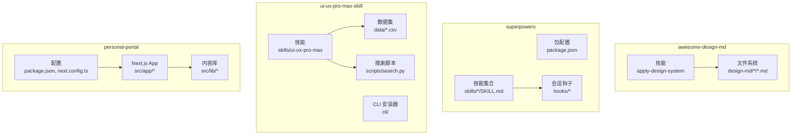
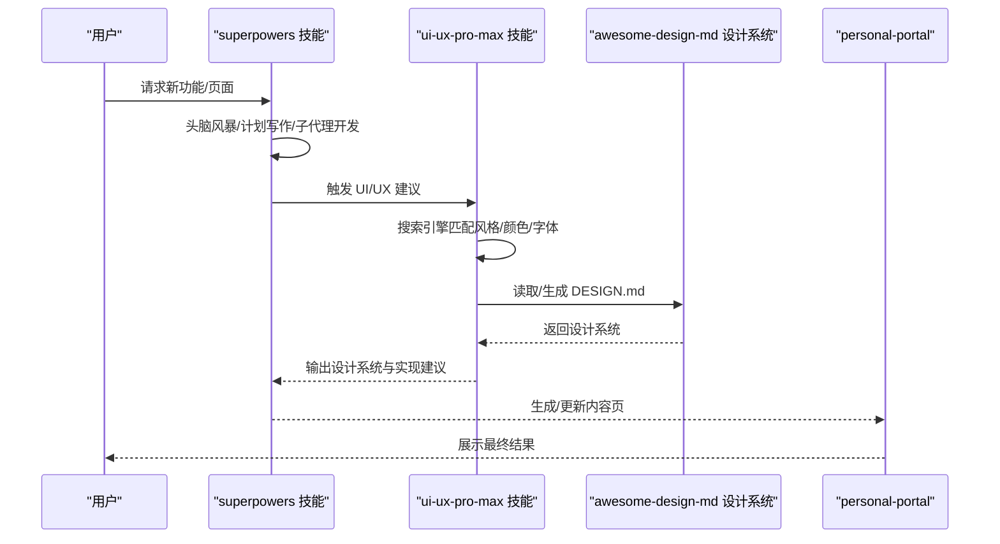
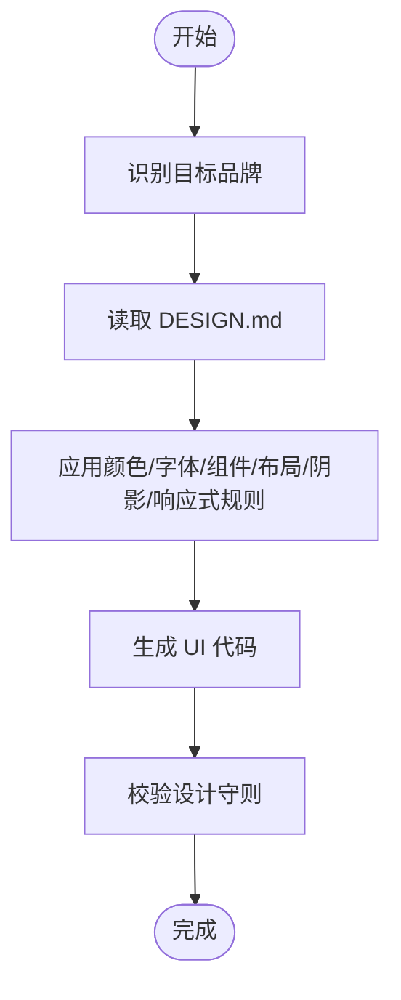
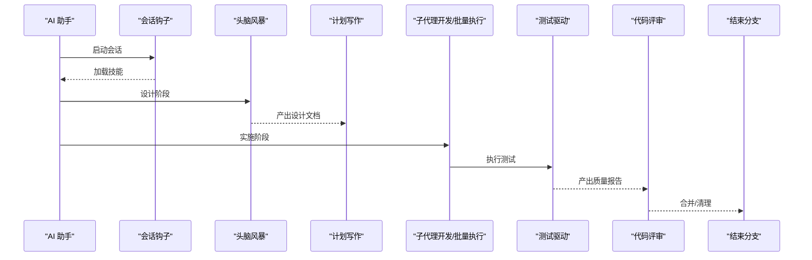
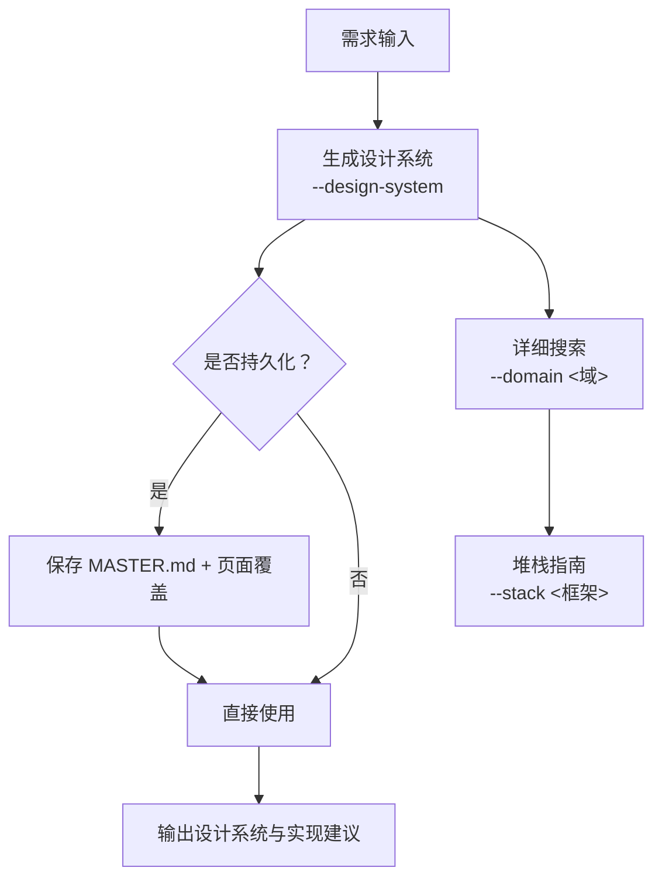
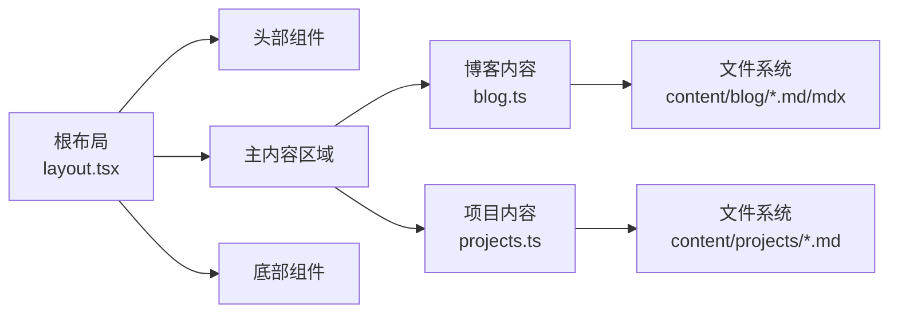
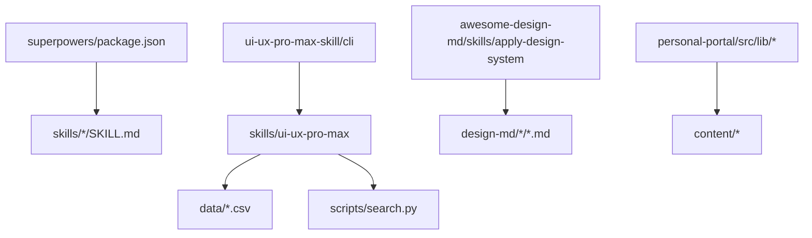

# 技术架构

<cite>
**本文档引用的文件**
- [awesome-design-md/README.md](file://awesome-design-md/README.md)
- [awesome-design-md/skills/apply-design-system/README.md](file://awesome-design-md/skills/apply-design-system/README.md)
- [awesome-design-md/skills/apply-design-system/SKILL.md](file://awesome-design-md/skills/apply-design-system/SKILL.md)
- [awesome-design-md/design-md/stripe/DESIGN.md](file://awesome-design-md/design-md/stripe/DESIGN.md)
- [superpowers/README.md](file://superpowers/README.md)
- [superpowers/package.json](file://superpowers/package.json)
- [superpowers/skills/brainstorming/SKILL.md](file://superpowers/skills/brainstorming/SKILL.md)
- [ui-ux-pro-max-skill/README.md](file://ui-ux-pro-max-skill/README.md)
- [ui-ux-pro-max-skill/skills/ui-ux-pro-max/SKILL.md](file://ui-ux-pro-max-skill/skills/ui-ux-pro-max/SKILL.md)
- [ui-ux-pro-max-skill/skills/ui-ux-pro-max/data/ui-reasoning.csv](file://ui-ux-pro-max-skill/skills/ui-ux-pro-max/data/ui-reasoning.csv)
- [personal-portal/README.md](file://personal-portal/README.md)
- [personal-portal/package.json](file://personal-portal/package.json)
- [personal-portal/src/app/layout.tsx](file://personal-portal/src/app/layout.tsx)
- [personal-portal/src/lib/blog.ts](file://personal-portal/src/lib/blog.ts)
- [personal-portal/src/lib/projects.ts](file://personal-portal/src/lib/projects.ts)
</cite>

## 目录
1. [引言](#引言)
2. [项目结构](#项目结构)
3. [核心组件](#核心组件)
4. [架构总览](#架构总览)
5. [详细组件分析](#详细组件分析)
6. [依赖关系分析](#依赖关系分析)
7. [性能考量](#性能考量)
8. [故障排查指南](#故障排查指南)
9. [结论](#结论)
10. [附录](#附录)

## 引言
本文件面向开发者与架构师，系统阐述四个子项目的技术架构：awesome-design-md 的文件系统与设计系统应用机制、superpowers 的技能系统与工作流编排、ui-ux-pro-max-skill 的智能推荐与设计系统生成、以及 personal-portal 的 Next.js 应用架构。文档重点说明各项目的技术选型、模块化设计、插件与技能系统、API 接口形态、数据流转与集成方式，并给出性能与扩展性建议。

## 项目结构
四个子项目采用“插件/技能 + 数据 + 工具”的分层组织方式：
- awesome-design-md：以 DESIGN.md 设计系统为核心，提供可即插即用的设计语言包，支持在多平台 AI 助手中应用。
- superpowers：以“技能”为最小执行单元，通过会话钩子与自动触发机制，形成端到端的软件开发工作流。
- ui-ux-pro-max-skill：以“设计系统生成器 + 搜索引擎 + 多框架适配”为核心，提供跨平台 UI/UX 智能推荐。
- personal-portal：基于 Next.js App Router 的静态/动态混合内容站点，采用内容驱动的数据模型与组件化布局。

图表来源
- [awesome-design-md/skills/apply-design-system/SKILL.md:1-139](file://awesome-design-md/skills/apply-design-system/SKILL.md#L1-L139)
- [superpowers/package.json:1-24](file://superpowers/package.json#L1-L24)
- [ui-ux-pro-max-skill/skills/ui-ux-pro-max/SKILL.md:1-680](file://ui-ux-pro-max-skill/skills/ui-ux-pro-max/SKILL.md#L1-L680)
- [personal-portal/package.json:1-32](file://personal-portal/package.json#L1-L32)

章节来源
- [awesome-design-md/README.md:1-250](file://awesome-design-md/README.md#L1-L250)
- [superpowers/README.md:1-286](file://superpowers/README.md#L1-L286)
- [ui-ux-pro-max-skill/README.md:1-649](file://ui-ux-pro-max-skill/README.md#L1-L649)
- [personal-portal/README.md:1-37](file://personal-portal/README.md#L1-L37)

## 核心组件
- awesome-design-md
  - 文件系统：按品牌/平台分类存放 DESIGN.md 与预览文件，统一遵循 Google Stitch 的 DESIGN.md 规范。
  - 技能：apply-design-system 技能读取目标品牌的设计系统，指导生成符合该品牌风格的 UI。
- superpowers
  - 包配置：声明技能与扩展入口，支持多平台加载。
  - 技能：包含头脑风暴、计划写作、子代理开发、调试、测试等 14 个可组合技能，自动触发形成完整工作流。
- ui-ux-pro-max-skill
  - 数据：161 条产品类型规则、67 风格、57 字体组合、25 图表类型等 CSV 数据。
  - 脚本：Python 搜索引擎，支持并行域检索与 BM25 排序；支持持久化设计系统（Master + 页面覆盖）。
  - 技能：根据用户请求自动生成设计系统并输出 UI/UX 建议。
- personal-portal
  - Next.js App Router：页面路由、元数据、字体与全局样式。
  - 内容库：基于本地 Markdown/MDX 文件的内容读取与聚合，支持博客与项目列表。

章节来源
- [awesome-design-md/skills/apply-design-system/SKILL.md:1-139](file://awesome-design-md/skills/apply-design-system/SKILL.md#L1-L139)
- [superpowers/package.json:1-24](file://superpowers/package.json#L1-L24)
- [ui-ux-pro-max-skill/skills/ui-ux-pro-max/SKILL.md:1-680](file://ui-ux-pro-max-skill/skills/ui-ux-pro-max/SKILL.md#L1-L680)
- [personal-portal/src/app/layout.tsx:1-57](file://personal-portal/src/app/layout.tsx#L1-L57)
- [personal-portal/src/lib/blog.ts:1-73](file://personal-portal/src/lib/blog.ts#L1-L73)
- [personal-portal/src/lib/projects.ts:1-62](file://personal-portal/src/lib/projects.ts#L1-L62)

## 架构总览
四项目之间通过“设计系统 + 技能 + 内容”形成闭环：
- 设计系统：awesome-design-md 提供标准化的 DESIGN.md，ui-ux-pro-max-skill 基于规则生成或复用该系统。
- 技能编排：superpowers 将设计系统与 UI/UX 建议整合进开发工作流，确保先设计后实现。
- 内容驱动：personal-portal 展示设计系统与技能实践成果，作为外部集成的可视化入口。

图表来源
- [superpowers/skills/brainstorming/SKILL.md:1-160](file://superpowers/skills/brainstorming/SKILL.md#L1-L160)
- [ui-ux-pro-max-skill/skills/ui-ux-pro-max/SKILL.md:1-680](file://ui-ux-pro-max-skill/skills/ui-ux-pro-max/SKILL.md#L1-L680)
- [awesome-design-md/skills/apply-design-system/SKILL.md:1-139](file://awesome-design-md/skills/apply-design-system/SKILL.md#L1-L139)
- [personal-portal/src/app/layout.tsx:1-57](file://personal-portal/src/app/layout.tsx#L1-L57)

## 详细组件分析

### awesome-design-md：文件系统与设计系统应用
- 文件系统架构
  - 每个品牌/平台一个目录，包含 DESIGN.md 与预览文件，遵循统一规范，便于 AI 助手解析与生成 UI。
  - 支持“列表”查询与按品牌映射到具体目录。
- 设计系统应用流程
  - 识别目标品牌 → 读取 DESIGN.md 全量规范 → 严格遵循颜色/字体/组件/布局/阴影/响应式规则 → 生成生产级 UI 并校验设计守则。
- 技术要点
  - 使用纯文本 DESIGN.md，避免复杂工具链，降低解析成本。
  - 通过“语义名 + 十六进制值 + 功能角色”的颜色体系，确保主题一致性。
  - 组件样式与状态（悬停/激活/禁用）明确，利于自动化生成。

图表来源
- [awesome-design-md/skills/apply-design-system/SKILL.md:68-139](file://awesome-design-md/skills/apply-design-system/SKILL.md#L68-L139)
- [awesome-design-md/design-md/stripe/DESIGN.md:1-488](file://awesome-design-md/design-md/stripe/DESIGN.md#L1-L488)

章节来源
- [awesome-design-md/README.md:1-250](file://awesome-design-md/README.md#L1-L250)
- [awesome-design-md/skills/apply-design-system/SKILL.md:1-139](file://awesome-design-md/skills/apply-design-system/SKILL.md#L1-L139)
- [awesome-design-md/design-md/stripe/DESIGN.md:1-488](file://awesome-design-md/design-md/stripe/DESIGN.md#L1-L488)

### superpowers：技能系统与工作流编排
- 技能系统
  - 14 个可组合技能，自动触发，无需手动干预。
  - 通过会话钩子在启动时激活，支持多平台（Claude Code、Cursor、Codex、Pi 等）。
- 工作流编排
  - 头脑风暴 → 使用 Git Worktrees 分支隔离 → 计划写作 → 子代理开发/批量执行 → 测试驱动 → 代码评审 → 结束分支。
  - 每一步都有明确的任务清单与验证步骤，确保过程可审计、可回溯。
- 技术要点
  - 包配置声明技能与扩展入口，便于平台加载。
  - 技能间通过“前置检查 + 后置产出”的契约协作，降低耦合度。

图表来源
- [superpowers/package.json:1-24](file://superpowers/package.json#L1-L24)
- [superpowers/skills/brainstorming/SKILL.md:1-160](file://superpowers/skills/brainstorming/SKILL.md#L1-L160)
- [superpowers/README.md:200-217](file://superpowers/README.md#L200-L217)

章节来源
- [superpowers/README.md:1-286](file://superpowers/README.md#L1-L286)
- [superpowers/package.json:1-24](file://superpowers/package.json#L1-L24)
- [superpowers/skills/brainstorming/SKILL.md:1-160](file://superpowers/skills/brainstorming/SKILL.md#L1-L160)

### ui-ux-pro-max-skill：智能推荐与设计系统生成
- 智能推荐引擎
  - 多域并行搜索：产品类型、风格、颜色、落地页模式、字体组合、图表类型、UX 最佳实践、Google Fonts、堆栈指南。
  - 决策规则：基于 161 条行业规则（ui-reasoning.csv），使用 BM25 排序与优先级过滤。
- 设计系统生成
  - 支持“设计系统生成 + 详细搜索 + 堆栈最佳实践”的三步法。
  - 支持持久化：Master + 页面覆盖的层次化检索，提升跨会话一致性。
- 技术要点
  - Python 脚本作为核心推理引擎，CLI 作为安装与同步工具。
  - 支持多种前端/移动端框架（React、Next.js、Vue、Svelte、SwiftUI、Flutter 等）的最佳实践注入。

图表来源
- [ui-ux-pro-max-skill/skills/ui-ux-pro-max/SKILL.md:363-451](file://ui-ux-pro-max-skill/skills/ui-ux-pro-max/SKILL.md#L363-L451)
- [ui-ux-pro-max-skill/skills/ui-ux-pro-max/data/ui-reasoning.csv:1-163](file://ui-ux-pro-max-skill/skills/ui-ux-pro-max/data/ui-reasoning.csv#L1-L163)

章节来源
- [ui-ux-pro-max-skill/README.md:1-649](file://ui-ux-pro-max-skill/README.md#L1-L649)
- [ui-ux-pro-max-skill/skills/ui-ux-pro-max/SKILL.md:1-680](file://ui-ux-pro-max-skill/skills/ui-ux-pro-max/SKILL.md#L1-L680)
- [ui-ux-pro-max-skill/skills/ui-ux-pro-max/data/ui-reasoning.csv:1-163](file://ui-ux-pro-max-skill/skills/ui-ux-pro-max/data/ui-reasoning.csv#L1-L163)

### personal-portal：Next.js 应用架构
- 应用结构
  - App Router：页面路由、元数据、字体与全局样式，根布局统一注入头部与底部。
  - 内容库：博客与项目两类内容，均来自本地 Markdown/MDX 文件，经 gray-matter 解析，支持标签、日期、草稿等字段。
- 技术要点
  - 使用 Next/font 自动优化字体加载。
  - 采用 TypeScript 类型约束，保证内容模型一致性。
  - RSS/robots/sitemap 等 SEO 相关路由已内置。

图表来源
- [personal-portal/src/app/layout.tsx:1-57](file://personal-portal/src/app/layout.tsx#L1-L57)
- [personal-portal/src/lib/blog.ts:1-73](file://personal-portal/src/lib/blog.ts#L1-L73)
- [personal-portal/src/lib/projects.ts:1-62](file://personal-portal/src/lib/projects.ts#L1-L62)

章节来源
- [personal-portal/README.md:1-37](file://personal-portal/README.md#L1-L37)
- [personal-portal/package.json:1-32](file://personal-portal/package.json#L1-L32)
- [personal-portal/src/app/layout.tsx:1-57](file://personal-portal/src/app/layout.tsx#L1-L57)
- [personal-portal/src/lib/blog.ts:1-73](file://personal-portal/src/lib/blog.ts#L1-L73)
- [personal-portal/src/lib/projects.ts:1-62](file://personal-portal/src/lib/projects.ts#L1-L62)

## 依赖关系分析
- 插件/技能系统
  - superpowers 通过 package.json 声明技能与扩展入口，支持多平台加载。
  - ui-ux-pro-max-skill 通过 CLI 安装器生成各平台模板，确保文件结构一致。
- 数据依赖
  - awesome-design-md 的 apply-design-system 技能依赖 design-md/*/*.md 的 DESIGN.md。
  - ui-ux-pro-max-skill 的搜索与推荐依赖 data/*.csv 与 scripts/search.py。
- 内容依赖
  - personal-portal 的内容来源于本地 content/* 目录，通过 src/lib/* 读取与聚合。

图表来源
- [superpowers/package.json:1-24](file://superpowers/package.json#L1-L24)
- [ui-ux-pro-max-skill/skills/ui-ux-pro-max/SKILL.md:518-544](file://ui-ux-pro-max-skill/skills/ui-ux-pro-max/SKILL.md#L518-L544)
- [awesome-design-md/skills/apply-design-system/SKILL.md:28-80](file://awesome-design-md/skills/apply-design-system/SKILL.md#L28-L80)
- [personal-portal/src/lib/blog.ts:1-73](file://personal-portal/src/lib/blog.ts#L1-L73)
- [personal-portal/src/lib/projects.ts:1-62](file://personal-portal/src/lib/projects.ts#L1-L62)

章节来源
- [superpowers/package.json:1-24](file://superpowers/package.json#L1-L24)
- [ui-ux-pro-max-skill/skills/ui-ux-pro-max/SKILL.md:518-544](file://ui-ux-pro-max-skill/skills/ui-ux-pro-max/SKILL.md#L518-L544)
- [awesome-design-md/skills/apply-design-system/SKILL.md:28-80](file://awesome-design-md/skills/apply-design-system/SKILL.md#L28-L80)
- [personal-portal/src/lib/blog.ts:1-73](file://personal-portal/src/lib/blog.ts#L1-L73)
- [personal-portal/src/lib/projects.ts:1-62](file://personal-portal/src/lib/projects.ts#L1-L62)

## 性能考量
- awesome-design-md
  - 采用纯文本 DESIGN.md，解析开销低；生成 UI 时严格遵循设计令牌，减少运行时计算。
- superpowers
  - 技能自动触发，避免重复沟通成本；子代理开发支持并行与阶段性评审，缩短反馈周期。
- ui-ux-pro-max-skill
  - Python 搜索引擎支持并行域检索与 BM25 排序，减少无关结果；持久化设计系统降低重复计算。
- personal-portal
  - Next.js App Router 与静态资源优化（字体、图片）；内容读取在服务端进行，减少客户端负担。

## 故障排查指南
- ui-ux-pro-max-skill
  - CLI 版本过旧导致命令不可用：升级 npm 包后重试。
  - 安装路径不一致导致卸载失败：在原安装目录或全局目录中执行卸载。
  - Python 未安装：根据操作系统安装 Python 3.x。
  - 输出截断：使用 --max-length 参数调整限制。
- personal-portal
  - 开发服务器无法启动：确认 Node.js 与包管理器版本，检查端口占用。
  - 字体加载异常：确认 next/font 配置与网络访问。
- superpowers
  - Windows 环境需使用 Git Bash 运行会话钩子；若技能未生效，重新安装插件。

章节来源
- [ui-ux-pro-max-skill/README.md:564-633](file://ui-ux-pro-max-skill/README.md#L564-L633)
- [personal-portal/README.md:1-37](file://personal-portal/README.md#L1-L37)
- [superpowers/README.md:12-13](file://superpowers/README.md#L12-L13)

## 结论
本架构以“设计系统 + 技能 + 内容”为核心，构建了从设计到实现再到展示的闭环。awesome-design-md 提供标准化的设计语言，superpowers 保障开发流程的稳定性与可审计性，ui-ux-pro-max-skill 通过智能推荐提升设计效率，personal-portal 则作为成果展示与外部集成的窗口。四项目通过清晰的职责边界与数据契约协同工作，具备良好的扩展性与跨平台兼容能力。

## 附录
- 技术选型说明
  - 设计系统：采用纯文本 DESIGN.md，降低工具链复杂度，便于多平台解析。
  - 技能系统：以可组合技能与自动触发机制实现端到端工作流，减少人工干预。
  - 智能推荐：Python 脚本 + CSV 数据 + BM25 排序，兼顾准确性与性能。
  - 内容站点：Next.js App Router + TypeScript + 内容驱动，强调可维护性与 SEO 友好性。
- 扩展性设计
  - 插件/技能系统通过声明式入口与平台适配器扩展。
  - 设计系统与内容库通过文件约定与类型约束解耦。
  - 搜索与推荐通过 CSV 数据与脚本模块化，便于增量扩展。