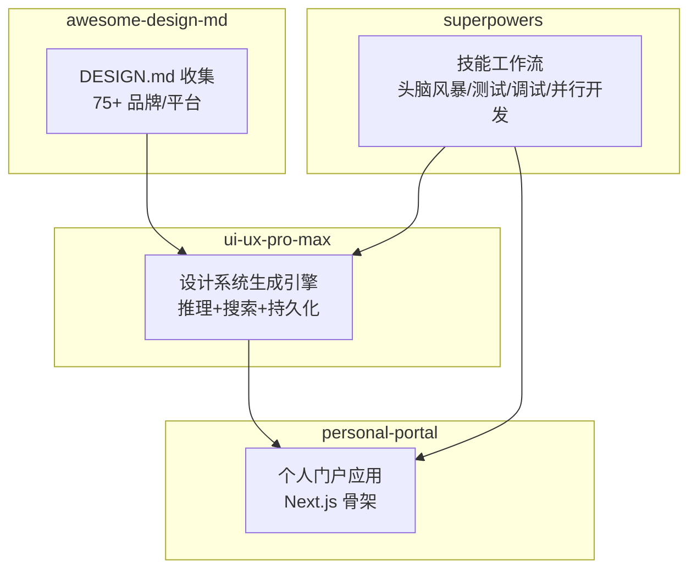
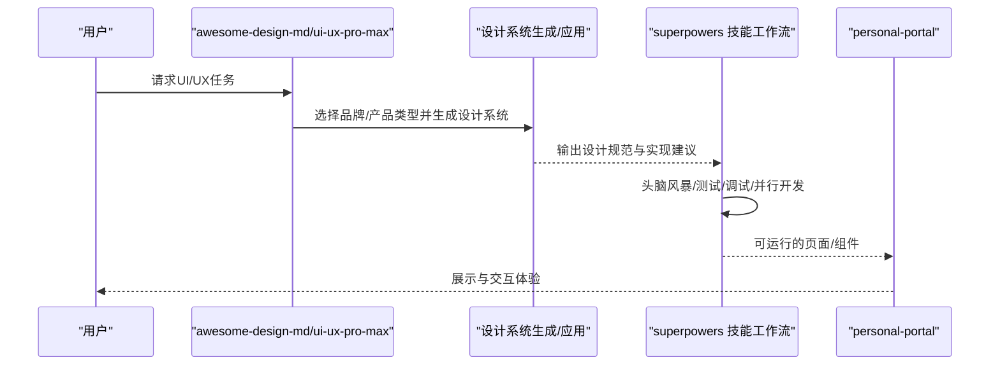
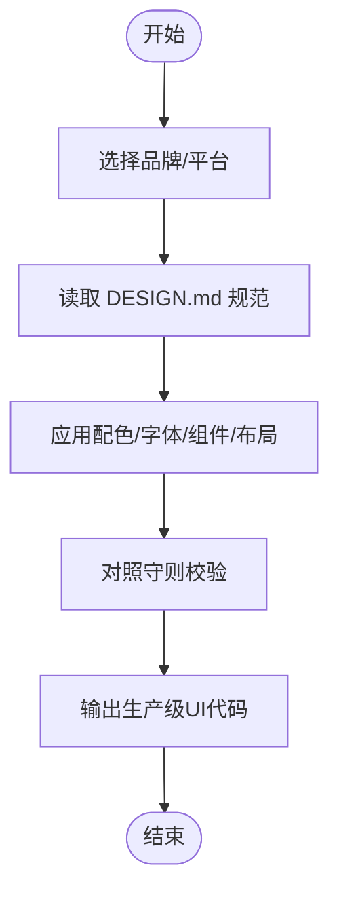
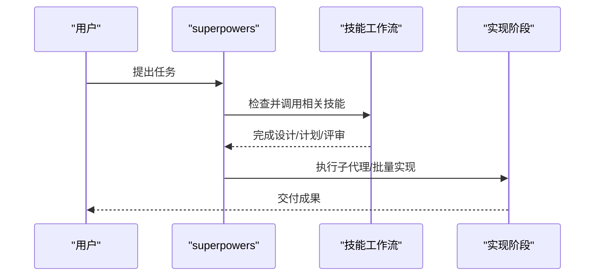
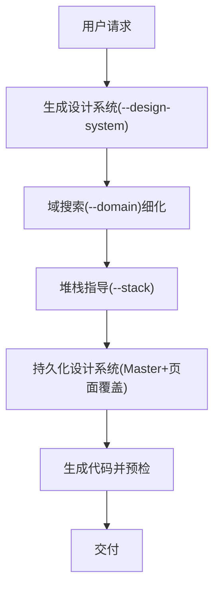
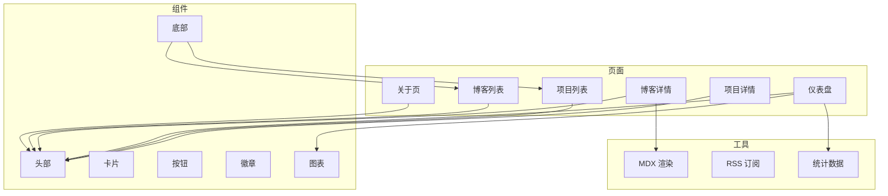
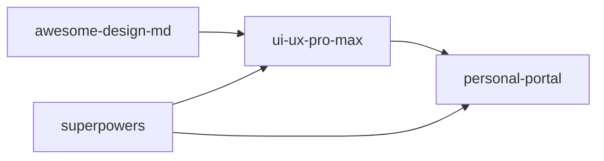

# 核心项目概览

<cite>
**本文引用的文件**
- [awesome-design-md/README.md](file://awesome-design-md/README.md)
- [awesome-design-md/skills/apply-design-system/SKILL.md](file://awesome-design-md/skills/apply-design-system/SKILL.md)
- [awesome-design-md/design-md/stripe/DESIGN.md](file://awesome-design-md/design-md/stripe/DESIGN.md)
- [superpowers/README.md](file://superpowers/README.md)
- [superpowers/skills/using-superpowers/SKILL.md](file://superpowers/skills/using-superpowers/SKILL.md)
- [superpowers/skills/brainstorming/SKILL.md](file://superpowers/skills/brainstorming/SKILL.md)
- [ui-ux-pro-max-skill/README.md](file://ui-ux-pro-max-skill/README.md)
- [ui-ux-pro-max-skill/skills/ui-ux-pro-max/SKILL.md](file://ui-ux-pro-max-skill/skills/ui-ux-pro-max/SKILL.md)
- [ui-ux-pro-max-skill/skills/ui-ux-pro-max/data/ui-reasoning.csv](file://ui-ux-pro-max-skill/skills/ui-ux-pro-max/data/ui-reasoning.csv)
- [personal-portal/README.md](file://personal-portal/README.md)
- [personal-portal/package.json](file://personal-portal/package.json)
</cite>

## 目录
1. [简介](#简介)
2. [项目结构](#项目结构)
3. [核心组件](#核心组件)
4. [架构总览](#架构总览)
5. [详细组件分析](#详细组件分析)
6. [依赖关系分析](#依赖关系分析)
7. [性能考量](#性能考量)
8. [故障排查指南](#故障排查指南)
9. [结论](#结论)
10. [附录](#附录)

## 简介
本文件面向希望快速了解与选择四类AI驱动设计与开发能力的用户，系统性梳理以下四个核心子项目：
- awesome-design-md 设计系统收集工具：提供75+品牌/平台的可直接用于AI生成的DESIGN.md设计系统，确保生成界面在风格、配色、排版、组件与交互上保持一致性。
- superpowers AI开发技能系统：一套可组合的“技能”工作流，覆盖从头脑风暴、测试驱动开发、系统化调试到子代理并行开发的完整软件工程方法论，帮助AI代理按流程高效交付。
- ui-ux-pro-max 智能设计生成器：基于行业规则与多维搜索的AI设计系统生成引擎，自动推荐风格、配色、字体、布局与交互细节，并输出跨栈实现建议。
- personal-portal 个人门户应用：基于Next.js的个人站点骨架，包含博客、仪表盘统计、项目展示等模块，适合开发者构建个人主页或作品集。

本概览将说明每个项目解决的问题、提供的价值、适用场景与目标用户，并阐述它们之间的互补关系与协同路径。

## 项目结构
四个项目分别聚焦不同层面的能力：
- awesome-design-md：以“设计系统文档”为核心资产，提供可被AI读取与遵循的规范文件，便于生成一致的UI。
- superpowers：以“技能工作流”为核心资产，定义从需求到实现的标准化过程，确保AI代理在复杂任务中不走偏。
- ui-ux-pro-max：以“设计系统生成引擎”为核心资产，通过数据与脚本实现“产品类型→风格→配色→字体→效果”的推理与推荐。
- personal-portal：以“前端应用模板”为核心资产，提供开箱即用的Next.js页面与组件，便于快速搭建个人站点。

图示来源
- [awesome-design-md/README.md:96-227](file://awesome-design-md/README.md#L96-L227)
- [superpowers/README.md:200-217](file://superpowers/README.md#L200-L217)
- [ui-ux-pro-max-skill/README.md:107-140](file://ui-ux-pro-max-skill/README.md#L107-L140)
- [personal-portal/README.md:1-37](file://personal-portal/README.md#L1-L37)

章节来源
- [awesome-design-md/README.md:96-227](file://awesome-design-md/README.md#L96-L227)
- [superpowers/README.md:200-217](file://superpowers/README.md#L200-L217)
- [ui-ux-pro-max-skill/README.md:107-140](file://ui-ux-pro-max-skill/README.md#L107-L140)
- [personal-portal/README.md:1-37](file://personal-portal/README.md#L1-L37)

## 核心组件
- awesome-design-md 的 apply-design-system 技能：支持按品牌名或“list”列出可用设计系统，读取对应 DESIGN.md 并严格应用于UI生成，最后对照“守则”进行校验。
- superpowers 的 using-superpowers 技能：强制在任何对话开始前检查并调用合适的技能，避免“先做后想”，并明确优先级与红灯提示。
- superpowers 的 brainstorming 技能：在实施前必须完成的“设计”阶段，要求探索上下文、提出方案、分段呈现设计并获得批准，再进入计划与实现。
- ui-ux-pro-max 的 ui-ux-pro-max 技能：自动触发的UI/UX设计智能，内置10大优先级规则、67种风格、161种颜色、57组字体搭配、161条行业推理规则，支持按域搜索与堆栈特定指导。
- personal-portal 的 Next.js 应用：提供博客、仪表盘、项目展示等页面与组件，使用Tailwind、Recharts、MDX等生态工具。

章节来源
- [awesome-design-md/skills/apply-design-system/SKILL.md:10-139](file://awesome-design-md/skills/apply-design-system/SKILL.md#L10-L139)
- [superpowers/skills/using-superpowers/SKILL.md:1-63](file://superpowers/skills/using-superpowers/SKILL.md#L1-L63)
- [superpowers/skills/brainstorming/SKILL.md:1-160](file://superpowers/skills/brainstorming/SKILL.md#L1-L160)
- [ui-ux-pro-max-skill/skills/ui-ux-pro-max/SKILL.md:1-680](file://ui-ux-pro-max-skill/skills/ui-ux-pro-max/SKILL.md#L1-L680)
- [personal-portal/package.json:1-32](file://personal-portal/package.json#L1-L32)

## 架构总览
四个项目在实际使用中形成“设计输入→设计生成→工程执行→成果呈现”的闭环：
- 设计输入：awesome-design-md 提供可直接注入AI的DESIGN.md；ui-ux-pro-max 提供基于产品类型的智能设计系统生成。
- 设计生成：awesome-design-md 通过“按品牌应用”得到风格一致的UI；ui-ux-pro-max 通过“设计系统生成+域搜索+堆栈指导”得到可落地的设计方案。
- 工程执行：superpowers 以技能工作流保障从头脑风暴到实现的质量与节奏，避免重复返工。
- 成果呈现：personal-portal 作为最终站点载体，承载生成的设计与内容。

图示来源
- [awesome-design-md/skills/apply-design-system/SKILL.md:68-139](file://awesome-design-md/skills/apply-design-system/SKILL.md#L68-L139)
- [superpowers/skills/brainstorming/SKILL.md:34-61](file://superpowers/skills/brainstorming/SKILL.md#L34-L61)
- [ui-ux-pro-max-skill/skills/ui-ux-pro-max/SKILL.md:353-531](file://ui-ux-pro-max-skill/skills/ui-ux-pro-max/SKILL.md#L353-L531)
- [personal-portal/README.md:1-37](file://personal-portal/README.md#L1-L37)

## 详细组件分析

### awesome-design-md 设计系统收集工具
- 功能定位：提供75+真实网站的DESIGN.md设计系统，让AI在生成UI时有据可依，避免风格漂移。
- 核心特性：
  - 结构化规范：主题氛围、配色角色、字体规则、组件样式、布局原则、层级阴影、守则与反模式、响应式行为、提示词指南。
  - 品牌覆盖广：AI/LLM平台、开发者工具、后端/DevOps、SaaS/生产力、设计/创意工具、金融/加密、电商/零售、媒体/消费科技、汽车、复古网页等。
  - 使用方式：复制目标站点的DESIGN.md至项目根目录，告知AI“按此风格生成”，即可产出一致的UI。
- 技术优势：
  - 采用纯文本格式，无需额外解析工具，LLM最易读取。
  - 每个设计系统包含预览页，便于直观对比。
- 解决的问题与价值：
  - 解决“AI生成UI风格不一致”的痛点，确保品牌语言与设计令牌在工程中落地。
  - 降低设计与开发之间的沟通成本，减少反复修改。
- 适用场景与目标用户：
  - 场景：需要快速生成符合特定品牌风格的页面或组件。
  - 用户：设计师、工程师、产品经理、内容创作者。
- 技术门槛：极低，只需复制粘贴DESIGN.md并告知AI使用。

图示来源
- [awesome-design-md/skills/apply-design-system/SKILL.md:68-139](file://awesome-design-md/skills/apply-design-system/SKILL.md#L68-L139)
- [awesome-design-md/README.md:228-250](file://awesome-design-md/README.md#L228-L250)

章节来源
- [awesome-design-md/README.md:44-250](file://awesome-design-md/README.md#L44-L250)
- [awesome-design-md/skills/apply-design-system/SKILL.md:10-139](file://awesome-design-md/skills/apply-design-system/SKILL.md#L10-L139)
- [awesome-design-md/design-md/stripe/DESIGN.md:1-200](file://awesome-design-md/design-md/stripe/DESIGN.md#L1-L200)

### superpowers AI开发技能系统
- 功能定位：为AI代理提供可组合的“技能工作流”，确保从需求到实现的每一步都有章可循。
- 核心特性：
  - 强制技能前置：任何任务开始前必须检查并调用相关技能，不可跳过。
  - 技能优先级：处理技能优先于实现技能；头脑风暴与系统化调试是高频使用。
  - 完整流程：头脑风暴→使用Git工作树→写计划→子代理/批量执行→测试驱动→代码评审→收尾分支。
- 技术优势：
  - 将“过程优于猜测”“复杂度最小化”“证据优于声明”等理念固化为技能规则。
  - 跨Harness兼容，支持多种AI平台。
- 解决的问题与价值：
  - 解决“无序开发导致返工”的问题，保证质量与效率。
  - 降低对人类干预的依赖，提升AI代理的自主交付能力。
- 适用场景与目标用户：
  - 场景：复杂功能开发、重构、调试、团队协作。
  - 用户：AI工程团队、高级工程师、项目经理。
- 技术门槛：中等，需理解技能优先级与工作流约束。

图示来源
- [superpowers/skills/using-superpowers/SKILL.md:18-32](file://superpowers/skills/using-superpowers/SKILL.md#L18-L32)
- [superpowers/skills/brainstorming/SKILL.md:34-61](file://superpowers/skills/brainstorming/SKILL.md#L34-L61)
- [superpowers/README.md:200-217](file://superpowers/README.md#L200-L217)

章节来源
- [superpowers/README.md:28-286](file://superpowers/README.md#L28-L286)
- [superpowers/skills/using-superpowers/SKILL.md:1-63](file://superpowers/skills/using-superpowers/SKILL.md#L1-L63)
- [superpowers/skills/brainstorming/SKILL.md:1-160](file://superpowers/skills/brainstorming/SKILL.md#L1-L160)

### ui-ux-pro-max 智能设计生成器
- 功能定位：基于行业推理规则与多维搜索，自动生成可落地的设计系统，并提供堆栈特定的最佳实践。
- 核心特性：
  - 推理引擎：161条行业规则，匹配产品类型→UI类别→风格优先级→反模式过滤→决策规则。
  - 多维搜索：产品类型、风格、配色、着陆页模式、字体搭配、图表类型、UX最佳实践、堆栈指导。
  - 持久化设计系统：Master + 页面覆盖的分层检索机制，支持跨会话复用。
- 技术优势：
  - Python脚本驱动的BM25搜索，精准匹配推荐。
  - 支持13+主流框架的堆栈指导，覆盖Web/移动端/桌面端。
- 解决的问题与价值：
  - 解决“设计方向不确定、风格选择困难、实现细节缺失”的问题，提供“从概念到代码”的完整路径。
  - 通过预设规则与反模式清单，显著降低设计风险。
- 适用场景与目标用户：
  - 场景：新页面/组件设计、品牌风格迁移、跨平台一致性保障。
  - 用户：UI/UX设计师、前端工程师、产品经理。
- 技术门槛：中等，需安装Python并理解域搜索与堆栈参数。

图示来源
- [ui-ux-pro-max-skill/skills/ui-ux-pro-max/SKILL.md:363-531](file://ui-ux-pro-max-skill/skills/ui-ux-pro-max/SKILL.md#L363-L531)
- [ui-ux-pro-max-skill/skills/ui-ux-pro-max/data/ui-reasoning.csv:1-163](file://ui-ux-pro-max-skill/skills/ui-ux-pro-max/data/ui-reasoning.csv#L1-L163)

章节来源
- [ui-ux-pro-max-skill/README.md:107-140](file://ui-ux-pro-max-skill/README.md#L107-L140)
- [ui-ux-pro-max-skill/skills/ui-ux-pro-max/SKILL.md:1-680](file://ui-ux-pro-max-skill/skills/ui-ux-pro-max/SKILL.md#L1-L680)
- [ui-ux-pro-max-skill/skills/ui-ux-pro-max/data/ui-reasoning.csv:1-163](file://ui-ux-pro-max-skill/skills/ui-ux-pro-max/data/ui-reasoning.csv#L1-L163)

### personal-portal 个人门户应用
- 功能定位：基于Next.js的个人站点骨架，集成博客、仪表盘、项目展示等模块，便于快速搭建个人主页。
- 核心特性：
  - 页面与路由：关于页、博客列表、博客详情、仪表盘、项目列表与详情。
  - 组件与工具：布局容器、页脚、头部、卡片、按钮、徽章、图表组件、MDX渲染、RSS订阅。
  - 依赖与生态：Next.js、Tailwind、Lucide图标、Recharts、Gray Matter、Feed等。
- 技术优势：
  - 开箱即用，适合快速原型与迭代。
  - 与ui-ux-pro-max结合，可直接套用其设计系统生成页面。
- 解决的问题与价值：
  - 解决“个人站点搭建成本高、维护复杂”的问题，提供统一的页面结构与组件体系。
- 适用场景与目标用户：
  - 场景：个人主页、作品集、技术博客、项目展示。
  - 用户：独立开发者、自由职业者、内容创作者。
- 技术门槛：入门级，熟悉Next.js与Tailwind即可。

图示来源
- [personal-portal/README.md:1-37](file://personal-portal/README.md#L1-L37)
- [personal-portal/package.json:11-29](file://personal-portal/package.json#L11-L29)

章节来源
- [personal-portal/README.md:1-37](file://personal-portal/README.md#L1-L37)
- [personal-portal/package.json:1-32](file://personal-portal/package.json#L1-L32)

## 依赖关系分析
- awesome-design-md 与 ui-ux-pro-max：前者提供“品牌风格”的设计系统，后者提供“产品类型+行业规则”的设计系统，二者可互补：前者强调风格一致性，后者强调专业性与可落地性。
- ui-ux-pro-max 与 superpowers：前者负责“设计系统生成与校验”，后者负责“工程流程与质量控制”，二者配合可确保“设计→实现”的顺畅衔接。
- personal-portal 与 ui-ux-pro-max：ui-ux-pro-max生成的设计系统可直接映射到personal-portal的页面与组件中，形成“设计→页面→交付”的闭环。
- superpowers 与 personal-portal：superpowers的技能工作流可用于personal-portal的迭代开发，确保每次更新都经过头脑风暴、计划、评审与测试。

图示来源
- [awesome-design-md/README.md:96-227](file://awesome-design-md/README.md#L96-L227)
- [superpowers/README.md:200-217](file://superpowers/README.md#L200-L217)
- [ui-ux-pro-max-skill/README.md:107-140](file://ui-ux-pro-max-skill/README.md#L107-L140)
- [personal-portal/README.md:1-37](file://personal-portal/README.md#L1-L37)

章节来源
- [awesome-design-md/README.md:96-227](file://awesome-design-md/README.md#L96-L227)
- [superpowers/README.md:200-217](file://superpowers/README.md#L200-L217)
- [ui-ux-pro-max-skill/README.md:107-140](file://ui-ux-pro-max-skill/README.md#L107-L140)
- [personal-portal/README.md:1-37](file://personal-portal/README.md#L1-L37)

## 性能考量
- awesome-design-md：纯文本DESIGN.md无需解析，LLM读取成本低；但设计系统数量庞大，建议按需引入，避免不必要的文件体积。
- superpowers：技能工作流强调“RED-GREEN-REFACTOR”与“证据验证”，有助于减少无效迭代，提升整体交付效率。
- ui-ux-pro-max：Python搜索脚本依赖BM25与CSV数据，建议在本地缓存常用查询结果；持久化设计系统可减少重复计算。
- personal-portal：Next.js的静态生成与按需加载策略可优化首屏性能；图表与媒体资源应按需懒加载。

## 故障排查指南
- awesome-design-md
  - 问题：应用品牌设计系统后出现配色/字体不一致
  - 处理：确认已完整读取DESIGN.md并严格按令牌映射；核对守则中的反模式清单
  - 参考：[apply-design-system 技能:68-139](file://awesome-design-md/skills/apply-design-system/SKILL.md#L68-L139)
- superpowers
  - 问题：未按技能前置导致任务混乱
  - 处理：阅读using-superpowers的规则，确保在任何对话开始前检查并调用相关技能
  - 参考：[using-superpowers 技能:18-32](file://superpowers/skills/using-superpowers/SKILL.md#L18-L32)
  - 问题：头脑风暴后无法进入实现阶段
  - 处理：确保设计文档已提交并通过用户审核
  - 参考：[brainstorming 技能:121-131](file://superpowers/skills/brainstorming/SKILL.md#L121-L131)
- ui-ux-pro-max
  - 问题：Python未找到或版本不兼容
  - 处理：按平台安装Python 3.x；Windows使用python而非python3
  - 参考：[ui-ux-pro-max 技能:308-334](file://ui-ux-pro-max-skill/skills/ui-ux-pro-max/SKILL.md#L308-L334)
  - 问题：设计系统输出被截断
  - 处理：使用--max-length 0提高限制
  - 参考：[README 故障排查:625-632](file://ui-ux-pro-max-skill/README.md#L625-L632)
- personal-portal
  - 问题：开发服务器启动失败
  - 处理：检查Node版本与依赖安装；使用npm/yarn/pnpm/bun任一包管理器
  - 参考：[personal-portal README:5-15](file://personal-portal/README.md#L5-L15)

章节来源
- [awesome-design-md/skills/apply-design-system/SKILL.md:68-139](file://awesome-design-md/skills/apply-design-system/SKILL.md#L68-L139)
- [superpowers/skills/using-superpowers/SKILL.md:18-32](file://superpowers/skills/using-superpowers/SKILL.md#L18-L32)
- [superpowers/skills/brainstorming/SKILL.md:121-131](file://superpowers/skills/brainstorming/SKILL.md#L121-L131)
- [ui-ux-pro-max-skill/skills/ui-ux-pro-max/SKILL.md:308-334](file://ui-ux-pro-max-skill/skills/ui-ux-pro-max/SKILL.md#L308-L334)
- [ui-ux-pro-max-skill/README.md:615-632](file://ui-ux-pro-max-skill/README.md#L615-L632)
- [personal-portal/README.md:5-15](file://personal-portal/README.md#L5-L15)

## 结论
- awesome-design-md 提供“风格一致性”的基础，确保生成UI与目标品牌语言高度契合。
- superpowers 提供“工程质量”的保障，确保从设计到实现的流程可控、可追溯。
- ui-ux-pro-max 提供“设计智能”的核心，将行业经验与多维搜索转化为可执行的设计系统。
- personal-portal 提供“成果呈现”的载体，便于将设计与内容快速上线。

四者协同可形成“设计输入→设计生成→工程执行→成果呈现”的完整闭环，满足从概念到上线的全流程需求。用户可根据自身角色与场景选择合适的模块组合：若追求风格一致性，优先awesome-design-md；若追求工程规范，优先superpowers；若追求设计智能与落地，优先ui-ux-pro-max；若需要快速呈现，优先personal-portal。

## 附录
- 快速选择建议
  - 需要品牌风格一致：awesome-design-md
  - 需要工程流程规范：superpowers
  - 需要设计系统生成与落地：ui-ux-pro-max
  - 需要个人站点骨架：personal-portal
- 进一步学习
  - 设计系统参考：[awesome-design-md README:204-227](file://awesome-design-md/README.md#L204-L227)
  - 技能工作流参考：[superpowers README:200-217](file://superpowers/README.md#L200-L217)
  - 设计系统生成参考：[ui-ux-pro-max README:107-140](file://ui-ux-pro-max-skill/README.md#L107-L140)
  - 个人门户参考：[personal-portal README:1-37](file://personal-portal/README.md#L1-L37)