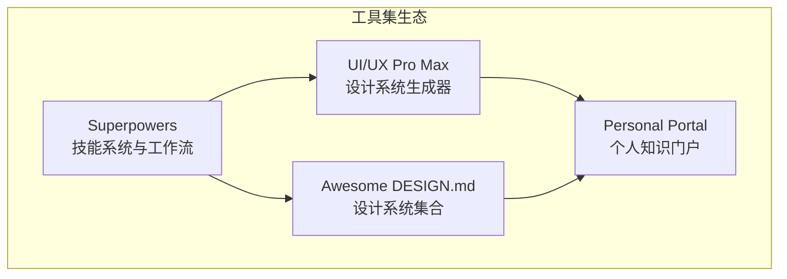
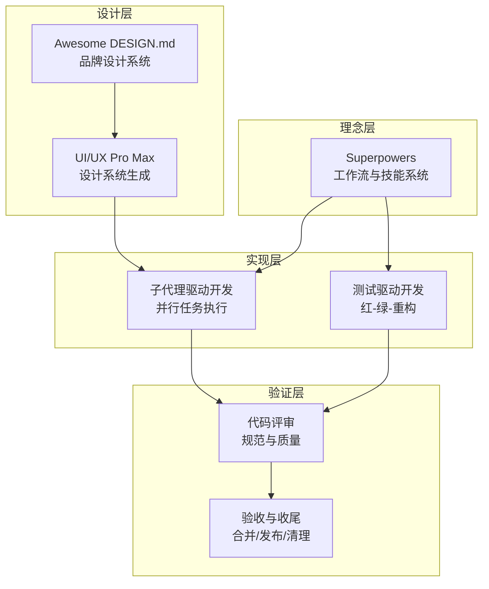
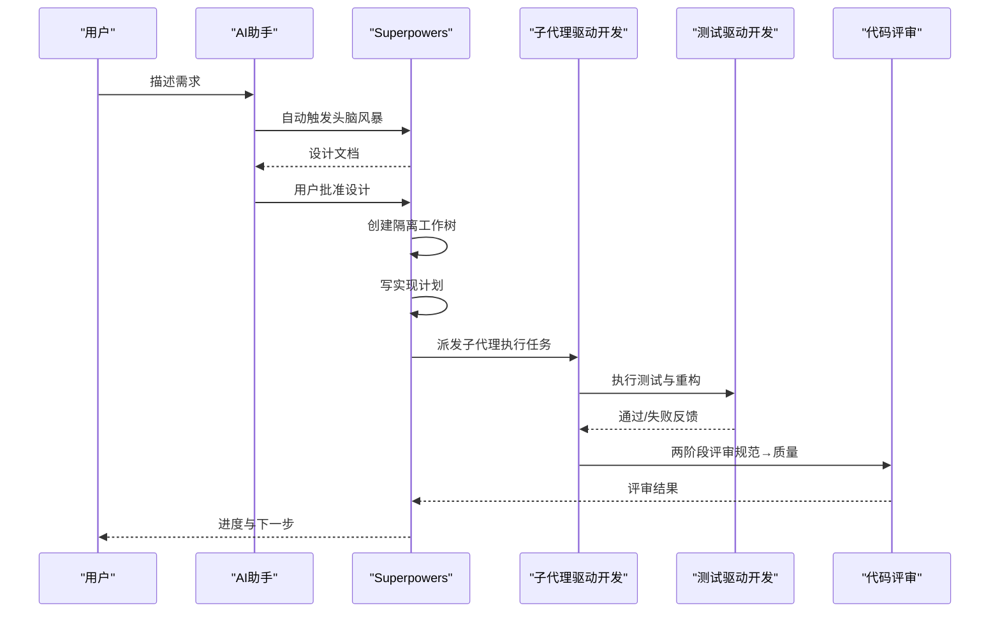
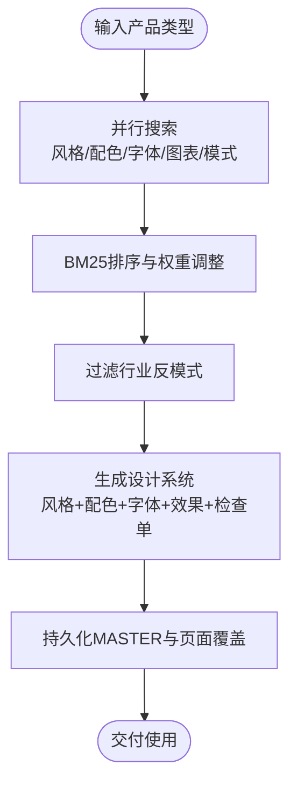
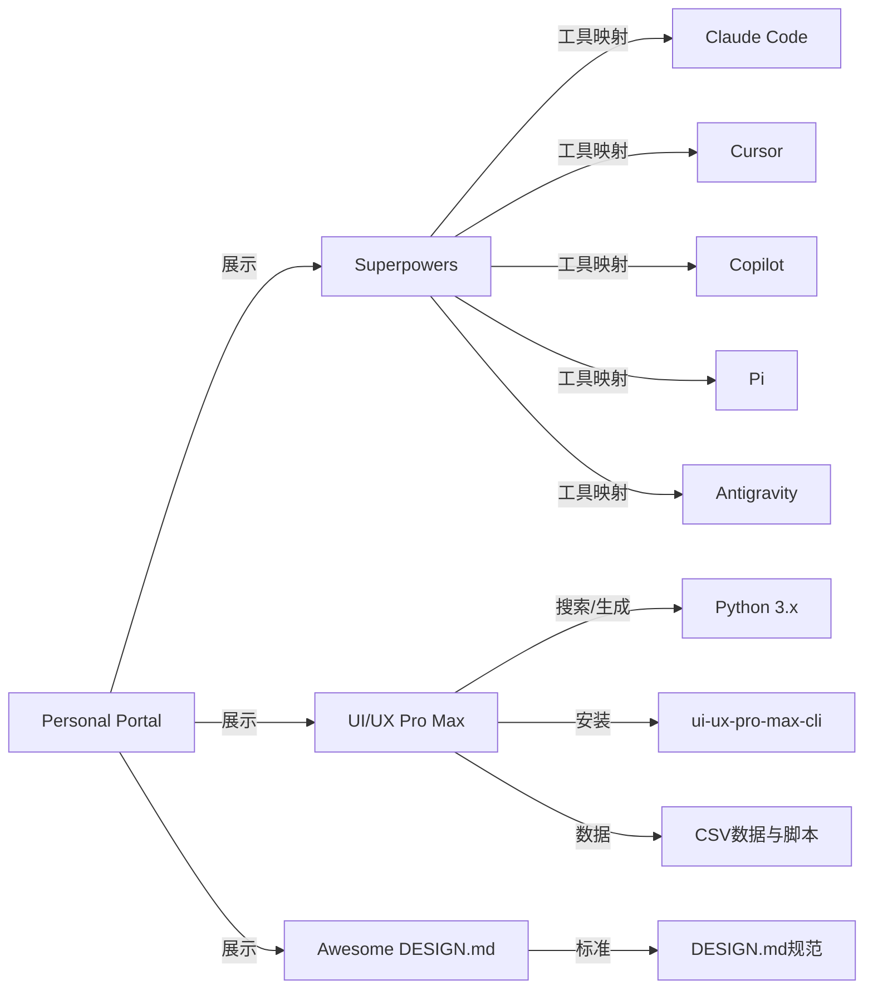

# 项目介绍

<cite>
**本文档引用的文件**
- [README.md](file://README.md)
- [superpowers/README.md](file://superpowers/README.md)
- [awesome-design-md/README.md](file://awesome-design-md/README.md)
- [ui-ux-pro-max-skill/README.md](file://ui-ux-pro-max-skill/README.md)
- [superpowers/RELEASE-NOTES.md](file://superpowers/RELEASE-NOTES.md)
- [superpowers/CLAUDE.md](file://superpowers/CLAUDE.md)
- [superpowers/package.json](file://superpowers/package.json)
- [ui-ux-pro-max-skill/skill.json](file://ui-ux-pro-max-skill/skill.json)
- [awesome-design-md/CONTRIBUTING.md](file://awesome-design-md/CONTRIBUTING.md)
- [ui-ux-pro-max-skill/CONTRIBUTING.md](file://ui-ux-pro-max-skill/CONTRIBUTING.md)
- [personal-portal/README.md](file://personal-portal/README.md)
</cite>

## 目录
1. [引言](#引言)
2. [项目结构](#项目结构)
3. [核心组件](#核心组件)
4. [架构总览](#架构总览)
5. [详细组件分析](#详细组件分析)
6. [依赖关系分析](#依赖关系分析)
7. [性能考量](#性能考量)
8. [故障排除指南](#故障排除指南)
9. [结论](#结论)
10. [附录](#附录)

## 引言
本综合性技术工具集项目旨在为开发者与设计团队提供一套可组合、跨平台、可自动触发的智能工作流与设计系统能力，覆盖从需求澄清、设计生成、开发执行到质量保障的全链路。项目由四大核心子项目构成：Superpowers（软件开发方法论与技能系统）、UI/UX Pro Max（AI驱动的设计系统与界面生成）、Awesome DESIGN.md（可直接被AI读取的设计系统集合）以及个人知识门户（Personal Portal）。它们共同形成“理念-设计-实现-展示”的闭环，帮助用户以更低的认知负担与更高的产出质量完成复杂工程任务。

本项目的核心价值在于：
- **统一范式**：通过标准化的“头脑风暴-计划-子代理执行-测试-评审-收尾”流程，降低工程不确定性。
- **跨平台兼容**：支持Claude Code、Cursor、Copilot、Pi、Antigravity等主流AI助手，确保一致体验。
- **设计一致性**：以DESIGN.md为契约，保证生成界面在品牌调性、配色、字体、交互上的一致性。
- **规模化复用**：通过技能系统与设计系统数据库，实现跨项目、跨团队的知识沉淀与复用。

## 项目结构
项目采用“多仓库聚合”的组织方式，每个子项目独立演进但共享生态：
- superpowers：技能系统与开发工作流引擎，提供14个可自动触发的技能，覆盖测试、调试、协作、元技能等。
- ui-ux-pro-max-skill：AI驱动的设计系统生成器，内置161条行业规则、67种UI风格、161种配色、57组字体系、25种图表类型与99条UX准则。
- awesome-design-md：DESIGN.md设计系统集合，收录73+真实网站的设计语言，便于直接应用到AI生成中。
- personal-portal：基于Next.js的个人知识门户，用于展示与链接这些工具集，提供博客、项目与仪表盘等功能。

**图示来源**
- [superpowers/README.md:200-217](file://superpowers/README.md#L200-L217)
- [ui-ux-pro-max-skill/README.md:165-174](file://ui-ux-pro-max-skill/README.md#L165-L174)
- [awesome-design-md/README.md:29-38](file://awesome-design-md/README.md#L29-L38)

**章节来源**
- [README.md:1-2](file://README.md#L1-L2)
- [personal-portal/README.md:1-37](file://personal-portal/README.md#L1-L37)

## 核心组件
- Superpowers 技能系统
  - 自动触发机制：在会话启动时注入引导文本，确保技能按优先级自动激活。
  - 工作流编排：头脑风暴→使用Git工作树→写计划→子代理驱动开发→测试驱动开发→请求代码评审→完成开发分支。
  - 跨平台适配：为Claude Code、Codex、Copilot、Pi、Antigravity等提供工具映射与安装指引。
  - 哲学内核：测试驱动、系统化优于直觉、复杂度最小化、证据优于声明。

- UI/UX Pro Max 设计系统生成器
  - 智能匹配：基于产品类型、风格、配色、字体与图表的并行搜索与BM25排序，输出完整设计系统。
  - 行业规则：161条针对不同行业的设计约束与最佳实践，避免“AI紫色/粉色渐变”等反模式。
  - 多栈支持：覆盖React、Vue、Flutter、SwiftUI、Jetpack Compose等17个技术栈。
  - 可持久化：支持MASTER.md与页面级覆盖文件，实现跨会话的层次检索。

- Awesome DESIGN.md 设计系统集合
  - 规范化：遵循Google Stitch的DESIGN.md格式，包含视觉主题、色彩、字体、组件样式、布局原则、深度与层级、响应式行为、代理提示词等。
  - 可即用：复制一个DESIGN.md到项目根目录，即可让任意AI编码助手生成符合该品牌语言的界面。
  - 丰富样本：涵盖AI平台、开发者工具、后端数据库、生产力与SaaS、设计与创意工具、金融科技、电商零售、媒体与消费科技、汽车等多个领域。

- 个人知识门户（Personal Portal）
  - 展示与导航：博客、项目、仪表盘统计，作为工具集的统一入口。
  - 开发友好：基于Next.js，提供开发现状、部署建议与优化资源链接。

**章节来源**
- [superpowers/README.md:200-217](file://superpowers/README.md#L200-L217)
- [superpowers/README.md:218-243](file://superpowers/README.md#L218-L243)
- [ui-ux-pro-max-skill/README.md:142-174](file://ui-ux-pro-max-skill/README.md#L142-L174)
- [awesome-design-md/README.md:204-227](file://awesome-design-md/README.md#L204-L227)
- [personal-portal/README.md:1-37](file://personal-portal/README.md#L1-L37)

## 架构总览
四大子项目通过“理念-设计-实现-验证”的闭环协同：
- 理念层（Superpowers）：定义开发范式与技能优先级，确保每次对话都先进行需求澄清与设计确认。
- 设计层（UI/UX Pro Max + Awesome DESIGN.md）：提供可复用的设计系统与品牌语言，保证生成结果在风格与一致性上达标。
- 实现层（Superpowers 子代理驱动开发）：将设计转化为可执行的任务清单，通过子代理并行推进，严格的质量门禁与评审机制贯穿始终。
- 验证层（测试驱动开发 + 代码评审）：以测试为先，持续验证与反馈，确保交付质量。

**图示来源**
- [superpowers/README.md:200-217](file://superpowers/README.md#L200-L217)
- [ui-ux-pro-max-skill/README.md:405-412](file://ui-ux-pro-max-skill/README.md#L405-L412)
- [awesome-design-md/README.md:204-227](file://awesome-design-md/README.md#L204-L227)

## 详细组件分析

### Superpowers 组件分析
Superpowers 是整个工具集的“中枢”，负责将抽象理念转化为可执行的工作流，并在不同AI助手之间保持一致的行为。

- 自动触发机制
  - 会话启动时注入引导文本，确保技能按优先级自动激活，避免用户记忆成本。
  - 平台适配：为各AI助手提供工具映射参考与安装说明，确保跨平台一致性。

- 工作流编排
  - 头脑风暴：在开始任何实现前，先澄清需求、探索方案、呈现设计并获得批准。
  - 使用Git工作树：在隔离分支中进行开发，避免污染主分支。
  - 写计划：将设计拆解为可执行任务，明确文件路径、代码与验证步骤。
  - 子代理驱动开发：为每个任务派发子代理，两阶段评审（规范符合性→代码质量），减少重复劳动。
  - 测试驱动开发：以测试为先，红-绿-重构循环，确保功能正确且可维护。
  - 请求/接收代码评审：在任务间或完成后进行评审，阻断缺陷进入后续迭代。
  - 完成开发分支：验证测试、合并/提交/清理工作树。

**图示来源**
- [superpowers/README.md:200-217](file://superpowers/README.md#L200-L217)
- [superpowers/README.md:220-243](file://superpowers/README.md#L220-L243)

**章节来源**
- [superpowers/README.md:28-39](file://superpowers/README.md#L28-L39)
- [superpowers/README.md:200-217](file://superpowers/README.md#L200-L217)
- [superpowers/README.md:218-243](file://superpowers/README.md#L218-L243)
- [superpowers/CLAUDE.md:1-116](file://superpowers/CLAUDE.md#L1-L116)

### UI/UX Pro Max 组件分析
UI/UX Pro Max 将“产品类型→风格→配色→字体→图表→UX准则”的设计决策自动化，显著降低设计门槛并提升一致性。

- 智能设计系统生成
  - 输入：产品描述（如“美容SPA”、“企业SaaS”等）。
  - 输出：推荐风格、配色、字体、关键效果、反模式清单与交付前检查表。
  - 搜索策略：并行搜索5类要素（产品类型、风格、配色、落地页模式、字体组合），BM25排序，过滤行业反模式。

- 数据与脚本
  - 数据库：styles.csv、colors.csv、rules.csv、charts.csv、typography.csv等。
  - 搜索脚本：Python实现的搜索引擎，支持命令行参数与持久化输出。
  - 模板：平台特定模板，通过CLI自动生成本地文件。

**图示来源**
- [ui-ux-pro-max-skill/README.md:107-140](file://ui-ux-pro-max-skill/README.md#L107-L140)
- [ui-ux-pro-max-skill/README.md:432-492](file://ui-ux-pro-max-skill/README.md#L432-L492)

**章节来源**
- [ui-ux-pro-max-skill/README.md:142-174](file://ui-ux-pro-max-skill/README.md#L142-L174)
- [ui-ux-pro-max-skill/README.md:405-412](file://ui-ux-pro-max-skill/README.md#L405-L412)
- [ui-ux-pro-max-skill/README.md:432-492](file://ui-ux-pro-max-skill/README.md#L432-L492)

### Awesome DESIGN.md 组件分析
该集合提供了可直接被AI读取的设计系统，确保生成界面与品牌语言一致。

- 文件规范
  - 视觉主题与氛围、色彩语义与角色、字体规则、组件样式（含状态）、布局原则、深度与层级、守则与反模式、响应式行为、代理提示词等。
- 应用方式
  - 将目标网站的DESIGN.md复制到项目根目录，再告知AI助手“使用该设计系统”，即可生成一致的界面。

**章节来源**
- [awesome-design-md/README.md:204-227](file://awesome-design-md/README.md#L204-L227)
- [awesome-design-md/README.md:228-234](file://awesome-design-md/README.md#L228-L234)

### 个人知识门户（Personal Portal）组件分析
Personal Portal 提供统一入口与展示，便于用户导航与分享工具集成果。

- 功能概览
  - 博客、项目、仪表盘统计等模块，支持RSS、站点地图与机器人协议。
  - 基于Next.js，提供开发与部署指南。

**章节来源**
- [personal-portal/README.md:1-37](file://personal-portal/README.md#L1-L37)

## 依赖关系分析
- Superpowers 依赖
  - 平台插件生态：各AI助手的插件/扩展系统（Claude Code、Cursor、Copilot、Pi、Antigravity等）。
  - 技能系统：14个可组合技能，彼此通过“工具映射参考”与“平台适配”保持一致性。
  - 版本与发布：通过发布说明与版本号管理，确保跨平台兼容与升级路径清晰。

- UI/UX Pro Max 依赖
  - Python运行时：搜索与生成脚本依赖Python 3.x。
  - CLI工具：ui-ux-pro-max-cli提供安装与同步能力，支持多平台。
  - 数据与模板：数据文件与模板通过CLI同步至各平台技能目录。

- Awesome DESIGN.md 依赖
  - 设计系统标准：遵循Google Stitch的DESIGN.md规范。
  - 社区贡献：通过贡献指南维护质量与一致性。

**图示来源**
- [superpowers/package.json:15-22](file://superpowers/package.json#L15-L22)
- [ui-ux-pro-max-skill/skill.json:20-40](file://ui-ux-pro-max-skill/skill.json#L20-L40)

**章节来源**
- [superpowers/package.json:1-24](file://superpowers/package.json#L1-L24)
- [ui-ux-pro-max-skill/skill.json:1-43](file://ui-ux-pro-max-skill/skill.json#L1-L43)

## 性能考量
- Token成本控制
  - 通过压缩引导文本、精简工具映射参考与改进评审流程，降低每会话令牌消耗。
  - 在子代理驱动开发中，将评审与差异以文件形式传递，减少上下文冗余。

- 启动与运行效率
  - 跨平台会话启动钩子与平台适配，确保首次消息即加载引导内容。
  - 零依赖的思维导图服务器与文件监控，减少外部依赖带来的启动延迟。

- 可扩展性
  - 技能系统与设计系统均采用数据驱动与脚本化，便于横向扩展新平台与新规则。

**章节来源**
- [superpowers/RELEASE-NOTES.md:3-11](file://superpowers/RELEASE-NOTES.md#L3-L11)
- [superpowers/RELEASE-NOTES.md:313-330](file://superpowers/RELEASE-NOTES.md#L313-L330)

## 故障排除指南
- Superpowers
  - Windows会话启动钩子：修正单引号转义与平台检测，确保在Git Bash与cmd.exe下均可正常执行。
  - 会话启动异步化：防止终端冻结，同时确保引导内容在首条消息前注入。
  - 会话启动上下文注入：区分平台特定输出与通用附加上下文，避免重复注入。

- UI/UX Pro Max
  - CLI安装权限：在macOS/Linux上建议使用Node版本管理器或sudo；也可使用npx免全局安装。
  - Python环境：确保已安装Python 3.x，不同操作系统安装方式见文档。
  - 设计系统输出截断：可通过--max-length参数调整截断限制。

- Awesome DESIGN.md
  - 贡献流程：先开issue讨论，再修复错误值、缺失令牌或弱描述，更新预览文件后提交PR。

**章节来源**
- [superpowers/RELEASE-NOTES.md:576-600](file://superpowers/RELEASE-NOTES.md#L576-L600)
- [ui-ux-pro-max-skill/README.md:564-633](file://ui-ux-pro-max-skill/README.md#L564-L633)
- [awesome-design-md/CONTRIBUTING.md:7-26](file://awesome-design-md/CONTRIBUTING.md#L7-L26)

## 结论
本综合性技术工具集通过“理念-设计-实现-验证”的闭环，为不同角色与场景提供了一套可组合、可复用、可扩展的智能工作流与设计系统能力。Superpowers确保开发过程系统化与可审计，UI/UX Pro Max与Awesome DESIGN.md保证生成结果在风格与一致性上达标，Personal Portal则提供统一的展示与导航入口。对于希望提升工程效率、降低设计成本、统一品牌语言的团队与个人，本项目提供了清晰的价值主张与实施路径。

## 附录
- 发展历程与版本规划
  - 通过发布说明可见，项目持续在“子代理驱动开发评审流程简化”“零依赖思维导图服务器”“平台适配与工具映射”等方面迭代，目标是降低成本、提升可靠性与跨平台一致性。
- 设计理念与哲学
  - 测试驱动、系统化优于直觉、复杂度最小化、证据优于声明。
- 社区与贡献
  - Superpowers对AI贡献者有严格要求，强调真实性、可验证性与人类把关；UI/UX Pro Max与Awesome DESIGN.md分别提供数据与设计系统的贡献指南。

**章节来源**
- [superpowers/RELEASE-NOTES.md:1-137](file://superpowers/RELEASE-NOTES.md#L1-L137)
- [superpowers/README.md:244-251](file://superpowers/README.md#L244-L251)
- [ui-ux-pro-max-skill/CONTRIBUTING.md:1-182](file://ui-ux-pro-max-skill/CONTRIBUTING.md#L1-L182)
- [awesome-design-md/CONTRIBUTING.md:1-26](file://awesome-design-md/CONTRIBUTING.md#L1-L26)