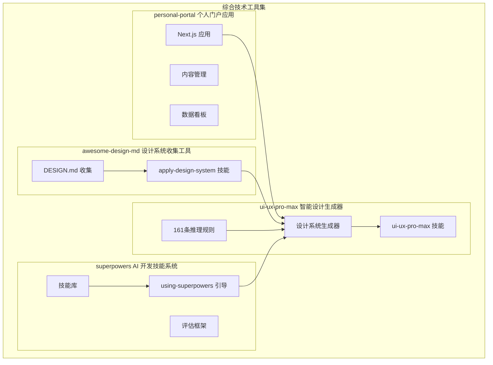
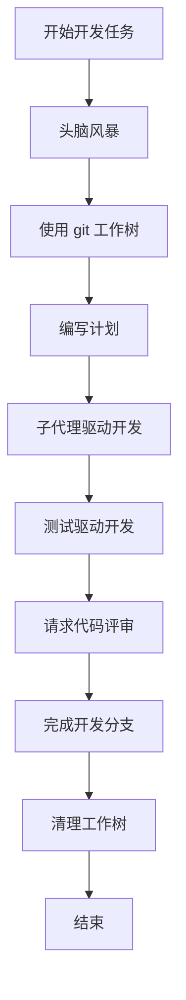
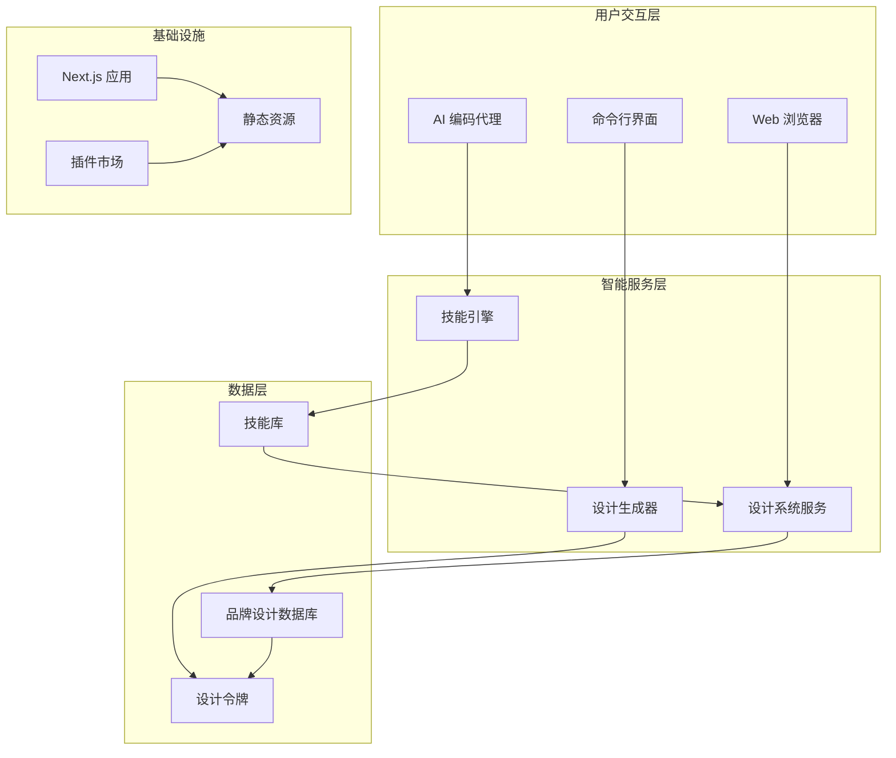
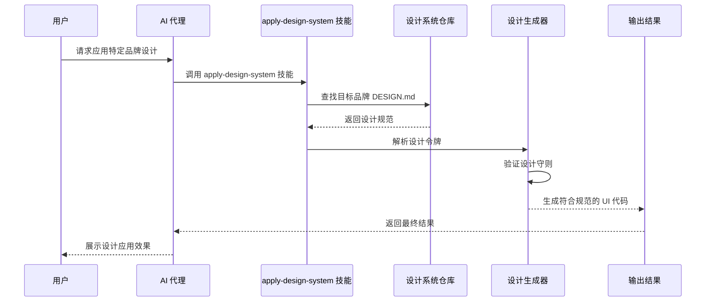
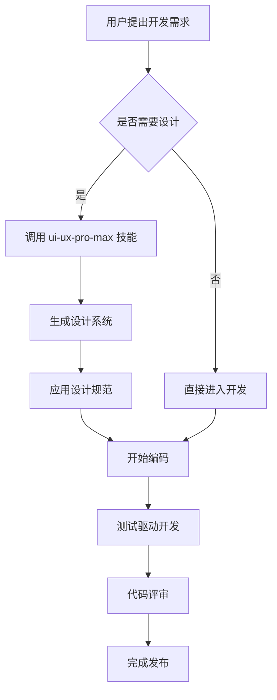
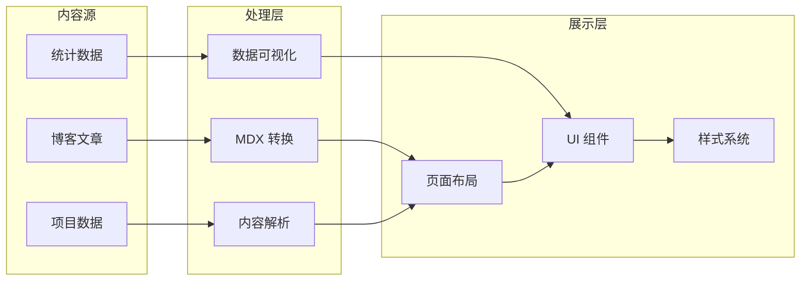
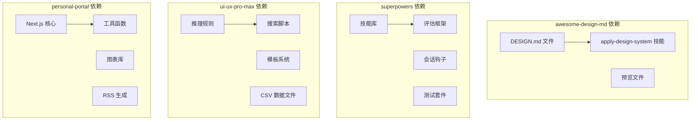

# 项目概览

<cite>
**本文档引用的文件**
- [README.md](file://README.md)
- [awesome-design-md/README.md](file://awesome-design-md/README.md)
- [awesome-design-md/skills/apply-design-system/SKILL.md](file://awesome-design-md/skills/apply-design-system/SKILL.md)
- [awesome-design-md/design-md/stripe/DESIGN.md](file://awesome-design-md/design-md/stripe/DESIGN.md)
- [superpowers/README.md](file://superpowers/README.md)
- [superpowers/skills/using-superpowers/SKILL.md](file://superpowers/skills/using-superpowers/SKILL.md)
- [superpowers/package.json](file://superpowers/package.json)
- [ui-ux-pro-max-skill/README.md](file://ui-ux-pro-max-skill/README.md)
- [ui-ux-pro-max-skill/skills/ui-ux-pro-max/SKILL.md](file://ui-ux-pro-max-skill/skills/ui-ux-pro-max/SKILL.md)
- [ui-ux-pro-max-skill/skills/ui-ux-pro-max/data/ui-reasoning.csv](file://ui-ux-pro-max-skill/skills/ui-ux-pro-max/data/ui-reasoning.csv)
- [personal-portal/README.md](file://personal-portal/README.md)
- [personal-portal/package.json](file://personal-portal/package.json)
- [personal-portal/src/app/layout.tsx](file://personal-portal/src/app/layout.tsx)
- [personal-portal/src/lib/utils.ts](file://personal-portal/src/lib/utils.ts)
- [personal-portal/next.config.ts](file://personal-portal/next.config.ts)
</cite>

## 目录
1. [引言](#引言)
2. [项目结构](#项目结构)
3. [核心组件](#核心组件)
4. [架构总览](#架构总览)
5. [详细组件分析](#详细组件分析)
6. [依赖关系分析](#依赖关系分析)
7. [性能考虑](#性能考虑)
8. [故障排除指南](#故障排除指南)
9. [结论](#结论)

## 引言

本项目是一个综合性技术工具集，旨在为开发者提供从设计系统到智能 UI 生成、从 AI 开发技能体系到个人知识门户的一站式解决方案。项目包含四大核心子项目：

- **awesome-design-md 设计系统收集工具**：提供 75+ 品牌的 DESIGN.md 设计规范，支持 AI 代理直接读取和应用
- **superpowers AI 开发技能系统**：构建在可组合技能上的完整软件开发方法论，涵盖测试驱动开发、调试、头脑风暴等 14 种核心技能
- **ui-ux-pro-max 智能设计生成器**：基于 161 条行业推理规则的 AI 设计系统生成引擎，支持跨平台 UI/UX 智能化
- **personal-portal 个人门户应用**：基于 Next.js 的个人技术门户，整合项目展示、技术博客与数据看板

## 项目结构

**图表来源**
- [awesome-design-md/README.md:1-250](file://awesome-design-md/README.md#L1-L250)
- [superpowers/README.md:1-286](file://superpowers/README.md#L1-L286)
- [ui-ux-pro-max-skill/README.md:1-649](file://ui-ux-pro-max-skill/README.md#L1-L649)
- [personal-portal/README.md:1-37](file://personal-portal/README.md#L1-L37)

## 核心组件

### awesome-design-md 设计系统收集工具

awesome-design-md 是一个精心策划的设计系统集合，提供了来自 75+ 知名网站的 DESIGN.md 文件。每个 DESIGN.md 文件都包含了完整的视觉语言规范，包括颜色调色板、字体规则、组件样式、布局原则、阴影系统、响应式行为等。

**核心特性：**
- **标准化格式**：遵循 Google Stitch 的 DESIGN.md 规范
- **品牌覆盖广泛**：涵盖 AI 平台、开发者工具、金融科技、电商零售等多个领域
- **AI 友好**：纯文本格式，无需特殊解析工具
- **即插即用**：支持直接应用到任何项目中

**技术实现：**
- 使用 Markdown 格式存储设计规范
- 每个品牌都有独立的目录结构
- 包含预览文件验证设计系统一致性

**章节来源**
- [awesome-design-md/README.md:44-250](file://awesome-design-md/README.md#L44-L250)
- [awesome-design-md/skills/apply-design-system/SKILL.md:10-139](file://awesome-design-md/skills/apply-design-system/SKILL.md#L10-L139)

### superpowers AI 开发技能系统

superpowers 是一个完整的软件开发方法论，构建在可组合技能之上。它为编码代理提供了一套标准化的工作流程，确保开发过程的系统性和可重复性。

**核心技能体系：**
- **测试驱动开发**：RED-GREEN-REFACTOR 循环
- **系统化调试**：四阶段根因分析
- **头脑风暴**：苏格拉底式设计优化
- **协作技能**：代码评审、并行开发分支管理
- **元技能**：技能创作、使用指南

**工作流程：**

**图表来源**
- [superpowers/README.md:200-217](file://superpowers/README.md#L200-L217)

**章节来源**
- [superpowers/README.md:15-286](file://superpowers/README.md#L15-L286)
- [superpowers/skills/using-superpowers/SKILL.md:18-63](file://superpowers/skills/using-superpowers/SKILL.md#L18-L63)

### ui-ux-pro-max 智能设计生成器

ui-ux-pro-max 是一个基于 AI 的设计系统生成引擎，能够根据项目需求自动生成完整的 UI/UX 设计规范。它内置了 161 条行业推理规则，涵盖从 SaaS 到医疗保健等所有常见产品类型。

**核心技术：**
- **多域搜索**：并行搜索产品类型、风格、颜色、着陆页模式、字体配对
- **推理引擎**：基于 JSON 条件规则的决策系统
- **设计系统生成**：输出完整的模式、风格、颜色、字体、效果规范
- **预交付检查清单**：自动验证设计质量

**设计推理规则：**
| 产品类别 | 推荐模式 | 风格优先级 | 颜色氛围 | 字体个性 |
|----------|----------|------------|----------|----------|
| SaaS (通用) | 英雄 + 功能 + CTA | 玻璃拟态 + 扁平设计 | 信任蓝色 + 强调对比 | 专业 + 层次感 |
| 金融仪表板 | 数据密集仪表板 | OLED 深色 + 数据密集 | 深色背景 + 红绿警示 + 信任蓝色 | 清晰 + 易读字体 |
| 医疗保健应用 | 社交证明聚焦 | 泞面 + 可访问性伦理 | 宁静蓝色 + 健康绿色 | 可读 + 大字号 |

**章节来源**
- [ui-ux-pro-max-skill/README.md:107-140](file://ui-ux-pro-max-skill/README.md#L107-L140)
- [ui-ux-pro-max-skill/skills/ui-ux-pro-max/SKILL.md:48-301](file://ui-ux-pro-max-skill/skills/ui-ux-pro-max/SKILL.md#L48-L301)
- [ui-ux-pro-max-skill/skills/ui-ux-pro-max/data/ui-reasoning.csv:1-163](file://ui-ux-pro-max-skill/skills/ui-ux-pro-max/data/ui-reasoning.csv#L1-L163)

### personal-portal 个人门户应用

personal-portal 是一个基于 Next.js 的个人技术门户应用，展示了项目管理、技术博客和数据分析能力。该应用采用现代化的前端技术栈，提供了良好的用户体验和 SEO 优化。

**技术架构：**
- **框架**：Next.js 16.2.10
- **UI 库**：Lucide React 图标库
- **数据可视化**：Recharts 图表库
- **内容管理**：Gray Matter 解析 Markdown
- **字体优化**：Next.js 内置 Geist 字体

**核心功能：**
- **项目展示**：展示个人技术项目和作品集
- **技术博客**：基于 MDX 的内容管理系统
- **数据看板**：统计信息和项目进度可视化
- **RSS 订阅**：内容聚合和分发

**章节来源**
- [personal-portal/README.md:1-37](file://personal-portal/README.md#L1-L37)
- [personal-portal/package.json:11-30](file://personal-portal/package.json#L11-L30)
- [personal-portal/src/app/layout.tsx:19-37](file://personal-portal/src/app/layout.tsx#L19-L37)

## 架构总览

**图表来源**
- [awesome-design-md/README.md:29-38](file://awesome-design-md/README.md#L29-L38)
- [superpowers/README.md:3-13](file://superpowers/README.md#L3-L13)
- [ui-ux-pro-max-skill/README.md:3-11](file://ui-ux-pro-max-skill/README.md#L3-L11)

## 详细组件分析

### 设计系统应用流程

**图表来源**
- [awesome-design-md/skills/apply-design-system/SKILL.md:68-121](file://awesome-design-md/skills/apply-design-system/SKILL.md#L68-L121)

### AI 开发工作流

**图表来源**
- [superpowers/README.md:200-217](file://superpowers/README.md#L200-L217)
- [ui-ux-pro-max-skill/skills/ui-ux-pro-max/SKILL.md:337-352](file://ui-ux-pro-max-skill/skills/ui-ux-pro-max/SKILL.md#L337-L352)

### 个人门户数据流

**图表来源**
- [personal-portal/src/app/layout.tsx:44-55](file://personal-portal/src/app/layout.tsx#L44-L55)
- [personal-portal/src/lib/utils.ts:1-21](file://personal-portal/src/lib/utils.ts#L1-L21)

**章节来源**
- [awesome-design-md/design-md/stripe/DESIGN.md:1-200](file://awesome-design-md/design-md/stripe/DESIGN.md#L1-L200)

## 依赖关系分析

**图表来源**
- [awesome-design-md/README.md:29-38](file://awesome-design-md/README.md#L29-L38)
- [superpowers/package.json:15-23](file://superpowers/package.json#L15-L23)
- [ui-ux-pro-max-skill/README.md:350-366](file://ui-ux-pro-max-skill/README.md#L350-L366)
- [personal-portal/package.json:11-30](file://personal-portal/package.json#L11-L30)

**章节来源**
- [superpowers/package.json:1-24](file://superpowers/package.json#L1-L24)

## 性能考虑

### 设计系统生成性能

- **并行搜索优化**：ui-ux-pro-max 使用并行搜索策略，同时查询产品类型、风格、颜色、着陆页模式和字体配对
- **缓存机制**：设计系统可以持久化保存，支持主文件和页面级覆盖模式
- **增量更新**：支持按需更新特定页面的设计规范

### AI 开发效率

- **自动化技能触发**：superpowers 系统自动检测适用技能，减少手动干预
- **并行子代理**：支持多个子代理同时处理不同任务
- **工作树隔离**：使用 git 工作树避免代码冲突

### 个人门户优化

- **静态资源优化**：Next.js 自动优化字体加载和图片处理
- **服务端渲染**：提升首屏加载速度和 SEO 表现
- **响应式设计**：适配多种设备和屏幕尺寸

## 故障排除指南

### 设计系统应用问题

**问题**：应用特定品牌设计后 UI 不一致
- 检查 DESIGN.md 文件完整性
- 验证设计守则中的反模式检查
- 确认颜色值和字体引用正确

**问题**：设计系统生成结果不符合预期
- 调整查询关键词组合
- 使用 `--domain` 参数进行详细搜索
- 检查推理规则的适用性

### AI 开发技能问题

**问题**：技能未按预期触发
- 确认技能优先级设置
- 检查会话钩子配置
- 验证技能文件完整性

**问题**：测试驱动开发循环异常
- 检查测试环境配置
- 验证测试文件路径
- 确认测试框架兼容性

### 个人门户部署问题

**问题**：Next.js 应用启动失败
- 检查 Node.js 版本兼容性
- 验证依赖包安装完整性
- 确认环境变量配置

**问题**：构建过程中出现错误
- 检查 TypeScript 配置
- 验证 Tailwind CSS 设置
- 确认路由配置正确性

**章节来源**
- [ui-ux-pro-max-skill/README.md:564-633](file://ui-ux-pro-max-skill/README.md#L564-L633)
- [superpowers/README.md:253-266](file://superpowers/README.md#L253-L266)
- [personal-portal/README.md:3-37](file://personal-portal/README.md#L3-L37)

## 结论

本综合性技术工具集项目通过四个核心子项目的协同工作，为现代软件开发提供了完整的解决方案。awesome-design-md 提供了丰富的设计系统资源，superpowers 确保了开发过程的系统性和可重复性，ui-ux-pro-max 实现了智能化的设计生成，personal-portal 展示了最佳实践的应用。

**核心价值主张：**
- **一体化解决方案**：从设计到开发再到展示的全流程覆盖
- **AI 增强开发**：通过技能系统和设计生成器提升开发效率
- **标准化规范**：统一的设计系统和开发流程标准
- **开源生态**：完善的贡献指南和社区支持

**应用场景：**
- 企业级软件开发团队的标准化工具链
- 独立开发者的设计系统应用
- 教育机构的 AI 辅助教学工具
- 个人技术品牌的展示和推广平台

该项目为初学者提供了清晰的入门路径，为有经验的开发者提供了深入的技术细节，是一个值得深入研究和应用的综合性技术工具集。